# JUNCTION — PRODUCTION SYSTEM IMPLEMENTATION BLUEPRINT
## Real-Time Mega-Event Hospitality & Destination Orchestration Platform
**Document Version:** 1.0.0-PROD-SPEC  
**Target System:** JUNCTION Enterprise Platform  
**Target Domain:** Mega-Event Orchestration (Wankhede Stadium & South Mumbai Destination Prototype Evolution)  
**Classification:** Technical Architecture & Engineering Implementation Specification  

---

## 1. Executive Summary

### 1.1 Vision & Platform Mandate
JUNCTION is an enterprise-grade **Mega-Event Hospitality & Destination Orchestration Platform**. It is specifically engineered to solve the systemic operational coordination breakdown that occurs during major global sporting, cultural, and civic gatherings. When 35,000 to 100,000+ attendees converge upon a municipal district within a concentrated time window, individual operational silos—venue gates, arterial roadways, rapid transit hubs, ride-hailing staging areas, and hospitality accommodations—fail independently because they lack unified situational awareness and predictive coordination.

JUNCTION does not operate as a passive analytical dashboard or a generic "smart city" visualization tool. Instead, JUNCTION is an **active operational coordination platform** operating on a continuous, closed-loop feedback paradigm:

```mermaid
flowchart TD
    subgraph OBSERVABILITY ["1. OBSERVE"]
        A1[Edge CCTV Sensor Nodes]
        A2[Hotel PMS & Partner Feeds]
        A3[GTFS-RT Transit Telemetry]
        A4[Municipal Traffic Sensors]
    end

    subgraph UNDERSTANDING ["2. UNDERSTAND"]
        B1[Ingestion & Normalization Engine]
        B2[Common Destination Data Model]
        B3[Current Usable Capacity Engine]
        B4[Multi-Signal Dynamic Pressure Engine]
    end

    subgraph INTELLIGENCE ["3. PREDICT & SIMULATE"]
        C1[XGBoost Horizon Predictors +15/30/60m]
        C2[Spatial Graph Cascade Engine]
        C3[What-If Macroscopic Flow Simulator]
    end

    subgraph ORCHESTRATION ["4. RECOMMEND & DECIDE"]
        D1[Multi-Objective Recommendation Engine]
        D2[Human-in-the-Loop Decision Governance]
        D3[Authorized Operator Command Action]
    end

    subgraph ACTION_PROPAGATION ["5. ACT & FEEDBACK"]
        E1[Dynamic Signage & Route Guidance]
        E2[Transit Agency Dispatch Adjustments]
        E3[Hospitality Surge Re-balancing]
        E4[Public Attendee Wayfinding Signals]
    end

    OBSERVABILITY --> UNDERSTANDING
    UNDERSTANDING --> INTELLIGENCE
    INTELLIGENCE --> ORCHESTRATION
    ORCHESTRATION --> ACTION_PROPAGATION
    ACTION_PROPAGATION -.->|Continuous Ground Truth Feedback| OBSERVABILITY

    classDef obs fill:#1e293b,stroke:#3b82f6,stroke-width:2px,color:#fff;
    classDef und fill:#1e293b,stroke:#10b981,stroke-width:2px,color:#fff;
    classDef int fill:#1e293b,stroke:#8b5cf6,stroke-width:2px,color:#fff;
    classDef orc fill:#1e293b,stroke:#f59e0b,stroke-width:2px,color:#fff;
    classDef act fill:#1e293b,stroke:#ef4444,stroke-width:2px,color:#fff;

    class A1,A2,A3,A4 obs;
    class B1,B2,B3,B4 und;
    class C1,C2,C3 int;
    class D1,D2,D3 orc;
    class E1,E2,E3,E4 act;
```

### 1.2 Core Architectural Principles
1. **Verifiable Data Provenance:** Every single operational metric displayed on a command console—whether an occupancy percentage, capacity threshold, or bottleneck pressure score—must be traceable back to its origin sensor, normalization timestamp, confidence factor, and mathematical transformation. No "black-box" magic numbers.
2. **Strict Privacy by Design (Edge Anonymization):** JUNCTION will never perform facial recognition, store personal biometric signatures, or transmit raw public CCTV video streams across the public cloud. Computer vision processing is executed strictly at the local edge, emitting only anonymous, aggregate spatial vectors and headcount counts.
3. **Decoupled Client Surfaces:** The Organizer Operations Console, Partner Portal, and Attendee Mobile Experience are strictly isolated front-end clients communicating exclusively via authenticated, role-governed APIs. No shared client-side memory or monolithic React Context in production.
4. **Resilient Degradation:** The platform is engineered to function under partial infrastructure failure. If third-party transit APIs timeout or a vision camera disconnects, the system automatically falls back to historical Kalman-smoothed profiles, flags data freshness degradation, and decreases recommendation confidence scores transparently.

---

## 2. Current Prototype Audit & Production Gap Analysis

### 2.1 Inventory of Existing Codebase Assets
The current repository contains a highly expressive, feature-complete prototype engineered with Next.js 15 (App Router), React 19, TypeScript, and Leaflet GIS mapping. An exhaustive inspection of the existing codebase reveals the following structural components:

| Component / File | Current Prototype Implementation | Production Characterization |
| :--- | :--- | :--- |
| `src/state/AppContext.tsx` | Monolithic client React Context managing active scenario, recommendations, dynamic hotel overrides, simulation state, and derived KPIs. | **REPLACE:** Monolithic in-memory React state must be replaced with server-side database storage, Redis caching, and real-time Server-Sent Events (SSE). |
| `src/state/AuthContext.tsx` | In-memory demo role authentication using `sessionStorage` with pre-configured mock credentials (`organizer`, `ramada`, `trident`). | **REPLACE:** Must be replaced with an OAuth 2.0 / OIDC JWT-based identity gateway (Keycloak / Auth0) with granular RBAC/ABAC claims. |
| `src/app/partner/page.tsx` | Property-scoped inventory management portal bound to `currentUser.propertyId`. Generates `hotelOverrides` affecting global KPIs. | **KEEP / EVOLVE:** The UX pattern and closed-loop data-flow concept are production-ready. Evolve to communicate via authenticated `POST /api/v1/partner/properties/{id}/inventory` APIs. |
| `src/app/organizer/*` | Command dashboard, KPI counters, alert drawer, resource inspection cards, and capacity utilization table. | **KEEP / EVOLVE:** Retain the operational UI paradigms; replace direct mock hooks with React Query consumers reading from production backend endpoints. |
| `src/components/organizer/map/` | Leaflet 1.9 + CartoDB Dark Matter raster tiles rendering 9 discrete layer components (Nodes, Roads, Flow, Density, Hotspots, Accommodation). | **REPLACE:** Leaflet raster tiles struggle with dense WebGL particle animation. Migrate to **MapLibre GL JS** using hardware-accelerated vector tiles and Deck.gl overlays. |
| `src/services/simulationEngine.ts` | Discrete-step cohort movement simulator enforcing human mass conservation along pre-defined network edges using a piecewise polynomial egress curve. | **KEEP / EVOLVE:** The mathematical conservation invariant is critical. Port the domain engine to a backend Python/Rust simulation worker capable of evaluating multi-scenario what-if simulations. |
| `src/services/mockDataService.ts` | Deterministic scenario lookups (`SCENARIOS`), usable room formulas (`calculateUsableRooms`), and synthetic pressure scores. | **REPLACE:** Replace static lookup tables with dynamic SQL/TimescaleDB models and continuous background pressure recalculation services. |
| `src/types/index.ts` | Comprehensive TypeScript domain interfaces (`Resource`, `Hotel`, `CrowdObservation`, `SimulationState`, `Recommendation`, `Alert`). | **KEEP / EVOLVE:** Domain ontology is exceptionally strong. Evolve these TypeScript interfaces into formal backend Pydantic models, OpenAPI specifications, and database DDL schemas. |

### 2.2 Component Classification Matrix

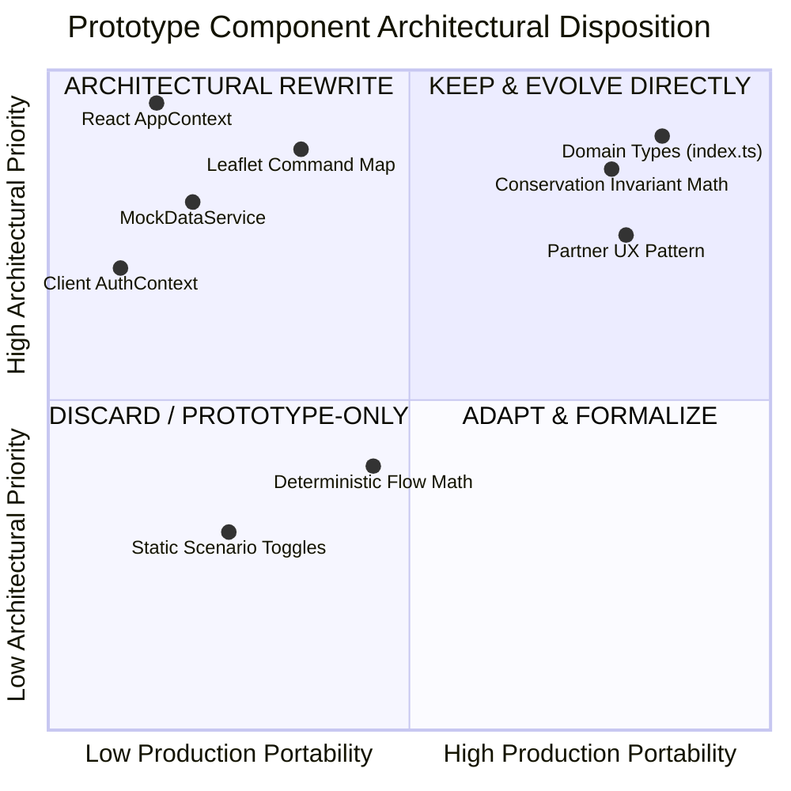

#### A. KEEP / EVOLVE
*   **Domain Data Model & Ontology:** The semantic separation between `Venue`, `TransportHub`, `Hotel`, `RoadEdge`, `CrowdObservation`, and `Recommendation` matches production destination operational requirements.
*   **Property-Scoped Partner Architecture:** The strict binding of hotel operators to their authorized `propertyId` with zero cross-tenant leak is an architectural foundation to be retained.
*   **Human Mass Conservation Principle:** The mathematical rule from `simulationEngine.ts` ($\sum N_{\text{exited}} = \sum N_{\text{transit}} + \sum N_{\text{road}} + \sum N_{\text{cleared}}$) must remain a formal automated integration test in the production backend.
*   **Dark Operations Theme & Information Hierarchy:** The density of operational indicators, alert badges, and color-coded pressure scales (`NORMAL`, `WATCH`, `HIGH`, `CRITICAL`) is already validated for high-stress command environments.

#### B. REPLACE
*   **Client-Side React Context State:** Must be replaced with a distributed server-side state architecture (PostgreSQL, TimescaleDB, Redis, and SSE broadcasting).
*   **Leaflet 1.9 Raster Canvas:** Replace with MapLibre GL JS (vector tiles) + Deck.gl to achieve 60fps rendering of 50,000+ dynamic human flow vectors and real-time crowd heatmaps.
*   **Static Scenario Lookups:** Replace hardcoded scenario JSON objects with dynamic prediction models (XGBoost) and live telemetry ingestion.
*   **Client-Side Session Storage Auth:** Replace with OAuth 2.0 / OpenID Connect using JSON Web Tokens (JWT) and signed cryptographic cookies.

#### C. PROTOTYPE-ONLY
*   **Deterministic Simulation Curves:** The hardcoded piecewise polynomials in `calculateOutflowRate` were created for demonstration; production simulation will ingest actual turnstile/gate flow curves and ML predictions.
*   **Client-Side Recommendation Approval:** Approving a recommendation in the prototype toggled an in-memory boolean; production requires a formal, auditable decision state machine with dispatch side-effects.

#### D. NEW PRODUCTION COMPONENTS TO BUILD
*   **Edge Computer Vision Daemon:** High-performance RTSP ingestion, YOLOv8 object detection, ByteTrack tracking, and polygonal tripwire integration.
*   **FastAPI Modular Monolith Core:** Production asynchronous Python backend coordinating state, capacity, cascade, and simulation engines.
*   **TimescaleDB Hypertable Engine:** Scalable temporal database for millions of time-series crowd observations.
*   **Real-Time SSE Event Broker:** High-throughput telemetry broadcasting system dispatching live destination changes to connected consoles.
*   **Automated Retraining & Feature Pipeline:** MLOps pipeline calculating sliding-window crowd features and serving low-latency XGBoost inferences.

---

## 3. Target Production Architecture

### 3.1 High-Level Architectural Blueprint
The target production platform follows an event-driven, streaming-ingestion, and centralized destination state architecture.

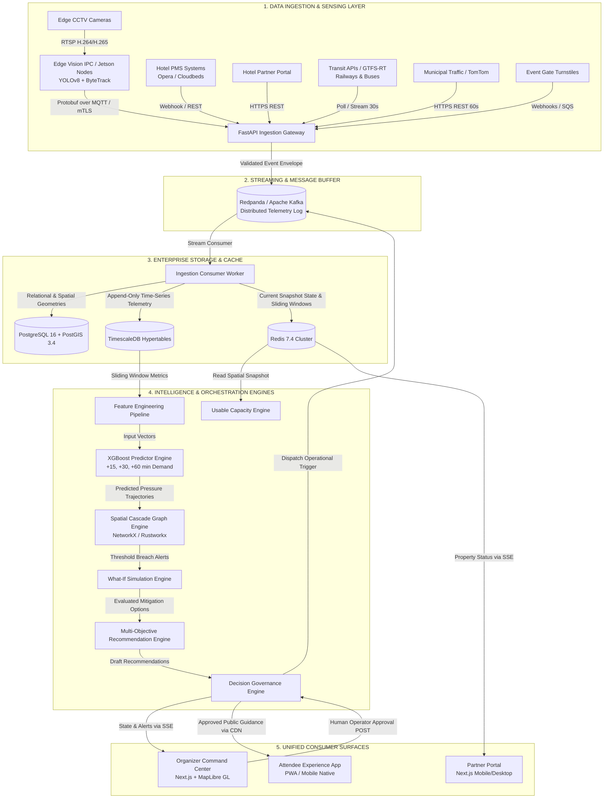

### 3.2 Detailed Component Layering

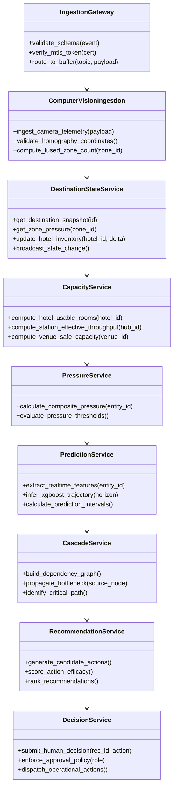

---

## 4. Operational Data Sources & Provenance Matrix

The following master matrix defines the precise operational provenance of every critical number utilized within JUNCTION.

| Metric Name | Origin Source | Protocol & Format | Ingestion SLA | Validation & Sanitization Gate | Primary Persistence | Intelligence Consumer | Fallback Strategy | Freshness SLA | Confidence Score Formula |
| :--- | :--- | :--- | :--- | :--- | :--- | :--- | :--- | :--- | :--- |
| **Turnstile Headcount** | Venue Access Control (RFID/Barcode Gates) | Webhook / AMQP JSON | 10 seconds | Cross-referenced against max physical turnstile rate (40/min/gate) | TimescaleDB `venue_ingress_log` | Inflow velocity, Egress model calibration | Static event schedule arrival curve | $\le 30\text{ sec}$ | $1.0$ (Direct digital count) |
| **Zone Pedestrian Count** | Edge CCTV Processing Nodes (NVIDIA Orin) | MQTT / Protobuf over mTLS | 1 second | Bounding box spatial clipping; max physical density ceiling ($6\text{ p/m}^2$) | Redis sliding window + TimescaleDB | Zone density, Crowd pressure, XGBoost | Historical baseline curve + Kalman smoothing | $\le 3\text{ sec}$ | $\min(1.0, \frac{\text{Active Cameras}}{\text{Required Cameras}} \times \text{Track Quality})$ |
| **Line-Crossing Pedestrian Flux** | Calibrated Edge Vision Virtual Counting Lines | MQTT / Protobuf | 1 second | Directional vector consistency filter ($|\vec{v}| \le 3.5\text{ m/s}$) | TimescaleDB `pedestrian_flux` | Inflow/outflow derivative, Corridor pressure | Historical corridor split ratios | $\le 3\text{ sec}$ | $0.85$ (Visual tracking accuracy under occlusion) |
| **Hotel Total Rooms** | Hotel PMS Integration (Opera/Cloudbeds API) | REST / HTTPS JSON | Hourly | Schema verification, capacity non-negative constraint | PostgreSQL `hotel_inventory` | Total available capacity denominator | Contracted static room allotment | $\le 1\text{ hour}$ | $1.0$ (System of record) |
| **Hotel Available Rooms** | PMS API or Authenticated Partner Portal | REST / HTTPS JSON | Real-time (Portal) / 5 min (PMS) | Range check ($0 \le \text{avail} \le \text{total} - \text{occupied}$) | PostgreSQL + Redis cache | Usable capacity engine, Accommodation pressure | Last known value; confidence decays $0.05/\text{hr}$ | $\le 5\text{ min}$ | $\text{API: } 0.95$, $\text{Partner Manual: } 0.85$ |
| **Hotel Out-of-Order Rooms** | Hotel PMS Maintenance Module | REST JSON | 15 minutes | Range check ($0 \le \text{ooo} \le \text{total}$) | PostgreSQL `hotel_inventory` | Subtracted from physical capacity | Assume 0 or last known | $\le 1\text{ hour}$ | $0.90$ |
| **Expected Check-Ins / Outs** | PMS Daily Forecast Feed | REST JSON | 30 minutes | Sanity check against historical booking velocity | PostgreSQL `hotel_forecast` | Net inventory turnover projection | Average mega-event check-in distribution | $\le 1\text{ hour}$ | $0.80$ |
| **Station Platform Footfall** | Transit Operator IR / Optical Sensors | Streaming REST / Webhook | 30 seconds | Zero-drop filter; max platform density limit | TimescaleDB `transit_hub_telemetry` | Station pressure, Cascade engine | Historical departure curves | $\le 60\text{ sec}$ | $0.90$ |
| **Train Headway & Delays** | GTFS-Realtime (TripUpdates & Alerts) | Protobuf over HTTP | 30 seconds | GTFS validator; reject negative delays | Redis key-value + TimescaleDB | Effective throughput reduction factor | Static scheduled timetable | $\le 45\text{ sec}$ | $0.95$ |
| **Road Travel Velocity** | Municipal Traffic Sensors / TomTom API | REST JSON | 60 seconds | Velocity bounded between $[0, 120]\text{ km/h}$ | TimescaleDB `road_telemetry` | Road congestion index, Dynamic travel times | Free-flow speed profile | $\le 2\text{ min}$ | $0.85$ |
| **Pickup Zone Queue Depth** | Edge CCTV Camera overlooking Staging Area | MQTT Protobuf | 5 seconds | Bounded by physical curb length (max 150 vehicles/people) | Redis + TimescaleDB | Taxi pressure, Cascade propagation | Egress modal split model | $\le 10\text{ sec}$ | $0.80$ |
| **Weather Precipitation Rate** | Municipal Radar / OpenWeather API | REST JSON | 5 minutes | Precipitation $\ge 0\text{ mm/hr}$ | PostgreSQL `weather_observations` | Crowd velocity dampening, Usable room buffer | National weather service bulletin | $\le 10\text{ min}$ | $0.95$ |

---

## 5. Source-of-Truth & Data Provenance Model

### 5.1 Hierarchy of Data Trust
To prevent unverified telemetry from destabilizing mission-critical operations, JUNCTION enforces an explicit 5-tier trust hierarchy:

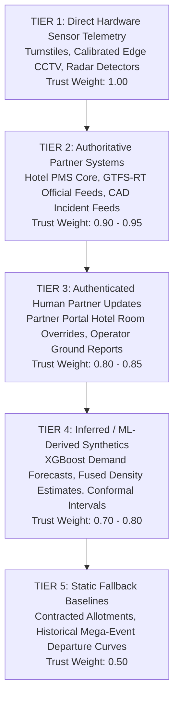

### 5.2 The Unified Provenance Envelope Specification
Every record ingested, processed, or exposed by JUNCTION wraps its payload inside an immutable **Provenance Envelope**:

```json
{
  "envelope_version": "1.0",
  "observation_id": "obs_cctv_wankhede_gate3_0019283",
  "entity_type": "ZONE_CROWD_OBSERVATION",
  "entity_id": "ZONE_A_WANKHEDE_CONCOURSE",
  "source_metadata": {
    "source_id": "cam_edge_node_wankhede_03",
    "source_type": "EDGE_CCTV_COMPUTER_VISION",
    "source_tier": 1,
    "firmware_version": "orin-v2.4.1-trt10",
    "calibration_id": "calib_2026_q2_h3"
  },
  "timestamps": {
    "observed_at": "2026-09-08T18:25:30.120Z",
    "edge_processed_at": "2026-09-08T18:25:30.185Z",
    "ingested_at": "2026-09-08T18:25:30.290Z",
    "normalized_at": "2026-09-08T18:25:30.315Z"
  },
  "metrics": {
    "people_count": 1850,
    "inflow_per_minute": 340,
    "outflow_per_minute": 120,
    "density_p_m2": 2.85
  },
  "quality": {
    "confidence_score": 0.92,
    "freshness_seconds": 0.195,
    "occlusion_ratio": 0.12,
    "anomaly_flag": false
  },
  "lineage_hash": "e3b0c44298fc1c149afbf4c8996fb92427ae41e4649b934ca495991b7852b855"
}
```

---

## 6. CCTV & Computer Vision Architecture (Edge-Only Anonymization)

### 6.1 Architectural Mandate & Privacy Boundaries
JUNCTION explicitly rejects cloud-based raw video streaming and biometric identification:
*   **Zero Facial Recognition:** Detection models are strictly limited to the `person` class bounding box. No facial keypoint extraction or biometric embedding models will be deployed.
*   **Edge Telemetry Only:** Video frames exist exclusively in volatile GPU memory at the local edge node. Frames are discarded immediately after inference. Only lightweight JSON/Protobuf telemetry metadata crosses the local network boundary to the JUNCTION backend.
*   **Zero Re-Identification Across Cameras:** Tracking identities (`track_id`) are ephemeral and localized to individual camera pipelines. When a person leaves Camera 1's field of view, their tracking token is permanently terminated.

```mermaid
flowchart LR
    subgraph SENSING_ENVIRONMENT ["PHYSICAL ENVIRONMENT"]
        CAM[Public Safety / Venue CCTV<br/>1080p @ 15-20 FPS]
    end

    subgraph EDGE_COMPUTE_NODE ["LOCAL SECURE EDGE (NVIDIA Jetson / x86 IPC)"]
        direction TB
        RTSP[RTSP / ONVIF Ingest] --> BUFFER[Ring Buffer Decoded NVMM]
        BUFFER --> DETECT[TensorRT YOLOv8x Detector<br/>Class: Person Only]
        DETECT --> TRACK[ByteTrack Kalman Tracker<br/>Local Ephemeral Track IDs]
        TRACK --> GEOM[Homography Projection Matrix<br/>Image XY -> World Ground Plane]
        GEOM --> LOGIC[Polygonal Zone Counting &<br/>Virtual Tripwire Vector Math]
        LOGIC --> TELEM[Aggregate Metric Synthesizer<br/>Count, Inflow, Outflow, Density]
        BUFFER -.->|Immediate Frame Discard| DUMP[Volatile RAM Flush]
    end

    subgraph CLOUD_BACKEND ["CENTRAL JUNCTION PLATFORM"]
        MQTT_BROKER[Secure Ingestion Endpoint<br/>mTLS + JWT Client Token]
        STATE_ENGINE[Destination State Service]
    end

    CAM -->|H.264 Local Cable| RTSP
    TELEM -->|Outbound Telemetry Only<br/>Protobuf / 4KB/s| MQTT_BROKER
    MQTT_BROKER --> STATE_ENGINE

    classDef edge fill:#0f172a,stroke:#10b981,stroke-width:2px,color:#fff;
    classDef cloud fill:#0f172a,stroke:#3b82f6,stroke-width:2px,color:#fff;
    class EDGE_COMPUTE_NODE edge;
    class CLOUD_BACKEND cloud;
```

### 6.2 Computer Vision Algorithmic Evaluation

| Subsystem | Selected Production Choice | Evaluated Alternatives | Rationale for Selection | Disqualification of Alternatives |
| :--- | :--- | :--- | :--- | :--- |
| **Object Detection** | **YOLOv8x (TensorRT FP16)** | YOLOv10, RT-DETR, Faster R-CNN | Proven sub-15ms latency on Jetson Orin; superior occlusion handling in high-density crowds (2-5 persons/$m^2$). | RT-DETR exhibits excessive memory overhead on low-power edge nodes; Faster R-CNN latency is unviable for 15fps multi-stream edge processing. |
| **Multi-Object Tracking** | **ByteTrack** | BoT-SORT, DeepSORT, StrongSORT | Association strategy leverages low-confidence detections (recovering occluded persons); negligible CPU overhead. | BoT-SORT's camera motion compensation is unnecessary on fixed CCTV; DeepSORT's Re-ID deep network violates privacy principles and increases latency. |
| **Edge Hardware Platform** | **NVIDIA Jetson Orin NX (16GB)** | Raspberry Pi 5, Intel Core i7 + RTX 4060, Cloud GPU Streaming | Industrial fanless form factor; 100 TOPS AI compute; operates within 25W; processes 4-6 1080p RTSP streams simultaneously. | Raspberry Pi lacks tensor cores for real-time dense inference; cloud streaming incurs prohibitive commercial bandwidth costs ($> \$1,500/\text{cam/mo}$). |

### 6.3 Mathematical Ground-Plane Projection & Zone Estimation
How does JUNCTION determine that *"There are 1,850 people in Zone A"*?

1. **Perspective Homography Transform:**  
   Each fixed camera is calibrated using 4 ground-control metric survey points, establishing a planar homography matrix $H \in \mathbb{R}^{3 \times 3}$:
   $$\begin{bmatrix} X_w \\ Y_w \\ 1 \end{bmatrix} \sim H \begin{bmatrix} x_i \\ y_i \\ 1 \end{bmatrix}$$
   where $(x_i, y_i)$ is the bottom-center coordinate of the detected person's bounding box (representing their foot contact with the ground), and $(X_w, Y_w)$ is the corresponding metric coordinate on the destination GIS map.

2. **Polygonal Zone Inclusion via Ray-Casting:**  
   Zone A is defined in PostGIS as a planar polygon $P = \{v_1, v_2, \dots, v_k\}$. For every tracked target footpoint $(X_w, Y_w)$, an asynchronous point-in-polygon ray-casting test determines membership.

3. **Multi-Camera Deduplication via Spatial DBSCAN:**  
   When Zone A is covered by multiple overlapping cameras (e.g., Camera 1 and Camera 2), footpoints projected onto the shared ground plane are clustered using spatial DBSCAN with $\epsilon = 0.8\text{ meters}$ and $\text{min\_samples} = 1$. Detections from different cameras within $0.8\text{m}$ of each other are collapsed into a single entity, eliminating double-counting at camera seams.

4. **Dense Crowd Density Fallback:**  
   In severe crush conditions ($> 4.5\text{ people/m}^2$) where individual bounding boxes merge completely, the pipeline automatically switches from discrete detection to a Gaussian Head Density Regression head (CSRNet/Bayesian Crowd Counting), estimating crowd mass directly from feature map texture energy.

---

## 7. Common Destination Data Model (CDDM)

The following relational schema represents the formal production Common Destination Data Model.

```mermaid
erDiagram
    DESTINATION ||--o{ ZONE : contains
    ZONE ||--o{ VENUE : contains
    ZONE ||--o{ TRANSPORT_HUB : contains
    ZONE ||--o{ HOTEL_PROPERTY : contains
    ZONE ||--o{ ROAD_SEGMENT : contains
    ZONE ||--o{ PICKUP_ZONE : contains
    VENUE ||--o{ EVENT : hosts
    HOTEL_PROPERTY ||--o{ ROOM_INVENTORY : tracks
    TRANSPORT_HUB ||--o{ TRANSPORT_ROUTE : serves
    ZONE ||--o{ CAMERA_SENSOR : observes
    CAMERA_SENSOR ||--o{ CROWD_OBSERVATION : emits
    ZONE ||--o{ PRESSURE_STATE : evaluates
    DESTINATION ||--o{ RECOMMENDATION : triggers
    RECOMMENDATION ||--o{ DECISION_LOG : governs

    DESTINATION {
        uuid id PK
        string name
        string timezone
        geometry boundary_polygon
    }
    ZONE {
        uuid id PK
        uuid destination_id FK
        string code
        string name
        geometry boundary_polygon
        integer baseline_capacity
    }
    VENUE {
        uuid id PK
        uuid zone_id FK
        string name
        integer physical_capacity
        integer safe_operating_capacity
        geometry footprint_polygon
    }
    EVENT {
        uuid id PK
        uuid venue_id FK
        string title
        timestamp start_time
        timestamp end_time
        integer expected_attendance
        string status
    }
    HOTEL_PROPERTY {
        uuid id PK
        uuid zone_id FK
        string name
        string external_pms_id
        integer total_rooms
        geometry location_point
    }
    ROOM_INVENTORY {
        uuid id PK
        uuid hotel_id FK
        integer available_rooms
        integer occupied_rooms
        integer out_of_order_rooms
        integer expected_checkins
        integer expected_checkouts
        timestamp recorded_at
        string source_type
    }
    TRANSPORT_HUB {
        uuid id PK
        uuid zone_id FK
        string name
        string mode_type
        integer nominal_throughput_per_hr
        geometry location_point
    }
    CROWD_OBSERVATION {
        uuid id PK
        uuid camera_id FK
        uuid zone_id FK
        timestamp observed_at
        integer people_count
        numeric inflow_rate
        numeric outflow_rate
        numeric density_p_m2
        numeric confidence_score
    }
    PRESSURE_STATE {
        uuid id PK
        uuid entity_id
        string entity_type
        numeric current_pressure
        numeric predicted_pressure_30m
        string pressure_level
        timestamp computed_at
    }
    RECOMMENDATION {
        uuid id PK
        uuid destination_id FK
        string trigger_code
        string title
        text rationale
        string urgency
        string status
        timestamp generated_at
    }
    DECISION_LOG {
        uuid id PK
        uuid recommendation_id FK
        string action_taken
        string decided_by_user_id
        timestamp decided_at
        text operator_rationale
    }
```

---

## 8. Database Architecture & Polyglot Storage Strategy

No single database engine satisfies the contradictory demands of spatial topology, millisecond-latency caching, high-frequency time-series telemetry, and relational audit logging. JUNCTION deploys a disciplined **polyglot persistence architecture**:

```mermaid
flowchart TD
    subgraph INGEST ["INGESTION DISPATCH"]
        IN[Normalized Telemetry Stream]
    end

    subgraph REDIS_CLUSTER ["1. REDIS 7.4 CLUSTER (IN-MEMORY CACHE & EVENT BUS)"]
        R1[Active Destination Snapshot State]
        R2[15-Minute Sliding Window Telemetry]
        R3[Pub/Sub Channel: 'destination:state:updates']
        R4[Distributed Locks (Redlock) for Recommendations]
    end

    subgraph POSTGRES_POSTGIS ["2. POSTGRESQL 16 + POSTGIS 3.4 (SYSTEM OF RECORD)"]
        P1[Static Destination Spatial Topologies (GIST Indexes)]
        P2[Organizations, Users, RBAC Credentials]
        P3[Audit Trails, Decision Records, Operator Actions]
        P4[Hotel Property Registries & Contracts]
    end

    subgraph TIMESCALE_HYPER ["3. TIMESCALEDB EXTENSION (TIME-SERIES ENGINE)"]
        T1[Hypertable: crowd_observations (Chunk: 1 day)]
        T2[Hypertable: road_telemetry (Chunk: 1 day)]
        T3[Hypertable: transit_telemetry (Chunk: 1 day)]
        T4[Continuous Aggregates (1-min, 5-min, 1-hour downsampling)]
    end

    subgraph S3_OBJECT_STORE ["4. MINIO / AWS S3 OBJECT STORAGE"]
        S1[XGBoost Serialized Model Artifacts (.json/.onnx)]
        S2[Camera Homography Calibration Matrices (.yaml)]
        S3[Historical Mega-Event Archive Dumps (.parquet)]
    end

    IN -->|Sub-millisecond writes| REDIS_CLUSTER
    IN -->|Batch insert every 1s| TIMESCALE_HYPER
    IN -->|Entity updates & audit logs| POSTGRES_POSTGIS
    TIMESCALE_HYPER -.->|Nightly cold export| S3_OBJECT_STORE

    classDef db fill:#0f172a,stroke:#3b82f6,stroke-width:2px,color:#fff;
    class REDIS_CLUSTER,POSTGRES_POSTGIS,TIMESCALE_HYPER,S3_OBJECT_STORE db;
```

### 8.1 Retention & Partitioning Governance
*   **Raw Telemetry (TimescaleDB):** Retained in uncompressed chunks for **7 days**. Compressed using Timescale columnar compression after 7 days, retained for **90 days**.
*   **Continuous Materialized Aggregates (1-Minute Intervals):** Retained for **365 days** to support year-over-year model retraining on recurring mega-events.
*   **Audit & Decision Logs (PostgreSQL):** Retained indefinitely (**7-year compliance standard**) in append-only tables with write-once-read-many (WORM) constraints.
*   **Transient Real-Time Windows (Redis):** TTL enforced strictly between **60 seconds and 15 minutes**.

---

## 9. Backend Architecture (Modular Monolith)

### 9.1 Architectural Paradigm Decision: Modular Monolith vs. Microservices
**ARCHITECTURAL DECISION: MODULAR MONOLITH (FastAPI + Async Python 3.12).**

JUNCTION explicitly rejects the premature decomposition of the core platform into 12+ separate distributed microservices for Version 1.0. 

*   **Rationale:** Mega-event destination orchestration requires atomic, cross-domain state evaluation (e.g., evaluating how a sudden 15-minute venue exit surge cascades simultaneously into road saturation, train delays, and hotel check-in congestion). Splitting these domain engines across separate HTTP-bounded microservices introduces network serialization overhead, distributed transaction lock complexity, and operational fragility precisely during high-load crises.
*   **Structure:** A strictly modular, domain-driven codebase within a single deployment unit. Modules interact via explicit Python domain protocols and in-process async method calls, with Redis Pub/Sub decoupling compute-heavy asynchronous background workers.

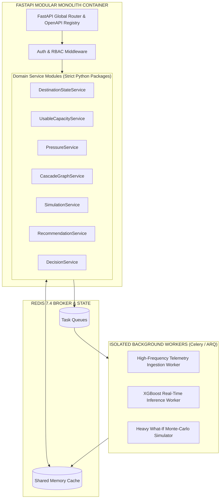

---

## 10. API Specifications & Contracts

### 10.1 Core Production Endpoints

#### 1. Ingest Edge CCTV Telemetry
*   **Endpoint:** `POST /api/v1/telemetry/cctv`
*   **Caller:** Edge Vision Nodes (Authenticated via mTLS + Device JWT)
*   **Payload:**
```json
{
  "camera_id": "cam_edge_wankhede_gate3_01",
  "zone_id": "018d9f42-4f1a-7b2c-8a1e-123456789abc",
  "observed_at": "2026-09-08T18:27:00.000Z",
  "people_count": 1420,
  "inflow_per_min": 280,
  "outflow_per_min": 110,
  "density_p_m2": 2.15,
  "confidence": 0.94
}
```
*   **Response:** `202 Accepted` (`{"status": "QUEUED", "ingest_latency_ms": 1.2}`)
*   **Side Effects:** Pushes event to Redis sliding window; triggers async `PressureRecalculationTask` if count deviation $> 10\%$.

#### 2. Partner Hotel Inventory Update
*   **Endpoint:** `POST /api/v1/partner/properties/{id}/inventory`
*   **Caller:** Hotel & Hospitality Partner Console
*   **Authorization:** Bearer JWT (`role: PARTNER`, claim: `property_id == {id}`)
*   **Payload:**
```json
{
  "available_rooms": 42,
  "expected_checkins": 85,
  "expected_checkouts": 12,
  "operator_notes": "Late check-in surge from tournament attendees expected."
}
```
*   **Response:** `200 OK`
```json
{
  "property_id": "018d9f42-4f1a-7b2c-8a1e-hotel0000001",
  "usable_rooms": 35,
  "recalculated_pressure": 78,
  "destination_capacity_delta": -8,
  "updated_at": "2026-09-08T18:27:02.105Z"
}
```
*   **Side Effects:** Invalidates Redis hotel cache; updates PostgreSQL `hotel_inventory`; dispatches `HOTEL_STATE_UPDATED` event over SSE to Organizer Console.

#### 3. Fetch Real-Time Destination Operational State
*   **Endpoint:** `GET /api/v1/destinations/{id}/state`
*   **Caller:** Organizer Command Center
*   **Authorization:** Bearer JWT (`role: ORGANIZER` or `role: CITY_OPS`)
*   **Response:** `200 OK` (Full JSON object containing current zone pressures, active alerts, usable accommodation capacity, and critical bottleneck nodes).

#### 4. Human Operator Recommendation Action
*   **Endpoint:** `POST /api/v1/recommendations/{id}/decision`
*   **Caller:** Authorized Organizer Operator
*   **Authorization:** Bearer JWT (`permission: EXECUTE_RECOMMENDATION`)
*   **Payload:**
```json
{
  "action": "APPROVE",
  "operator_notes": "Coordinated with Mumbai Traffic Police control room.",
  "execution_overrides": {
    "redirection_percentage": 25
  }
}
```
*   **Response:** `200 OK` (`{"decision_id": "dec_891238", "status": "EXECUTED", "dispatched_at": "..."}`)
*   **Side Effects:** Enters decision into audit trail; emits dispatch commands to transit/signage adapters; initiates 30-minute closed-loop feedback verification task.

---

## 11. Real-Time Data Flow & Propagation Architecture

### 11.1 End-to-End Latency Budget
From the exact millisecond a pedestrian enters a CCTV frame to the visual rendering of an updated pressure indicator on the Organizer's screen, the end-to-end latency SLA is **$\le 2,500\text{ milliseconds}$**:

```mermaid
gantt
    title End-to-End Real-Time Latency Budget (Target: < 2.5s)
    dateFormat X
    axisFormat %s ms

    section Edge Vision
    Camera Frame Capture & Decode       :0, 66
    TensorRT YOLOv8x Inference          :66, 120
    ByteTrack & Polygonal Logic         :120, 150
    Protobuf Packing & TLS Network Push :150, 220

    section Ingestion & State
    Gateway Schema Validation           :220, 240
    Redis Ingest & Sliding Window Push  :240, 280
    Capacity & Composite Pressure Calc  :280, 450

    section Intelligence
    XGBoost 30m Inference Update       :450, 650
    Cascade Dependency Evaluation       :650, 850
    Recommendation State Evaluation     :850, 1100

    section Client Delivery
    SSE Event Push via Traefik Proxy    :1100, 1250
    Organizer Browser State Hydration   :1250, 1350
    MapLibre WebGL Layer Re-render      :1350, 1450
```

### 11.2 Real-Time Protocol Selection
*   **Server-Sent Events (SSE) via HTTP/2:** Selected for all outbound server-to-client telemetry streams (Organizer Console KPIs, Map Vector Updates, Alert Toasts, Partner Inventory Sync).
    *   *Why SSE over WebSockets:* SSE is strictly unidirectional (server-to-client), operates seamlessly over standard HTTP/2 multiplexed connections, natively supports reconnection tokens and event IDs, passes through enterprise municipal firewalls without WebSocket proxy degradation, and requires zero client heartbeat negotiation overhead.
*   **Standard HTTPS REST:** Used for all inbound client-to-server command requests (Logins, Form submissions, Partner inventory writes, Operator approval clicks).
*   **WebSockets (Targeted Exception):** Reserved exclusively for interactive, bidirectional What-If simulation modeling sessions where an operator scrubs a scenario timeline slider interactively.

---

## 12. Prediction Engine & Machine Learning Architecture

### 12.1 Machine Learning Problem Formulation
JUNCTION deploys specialized machine learning models for 4 primary tabular and spatial-temporal problems:

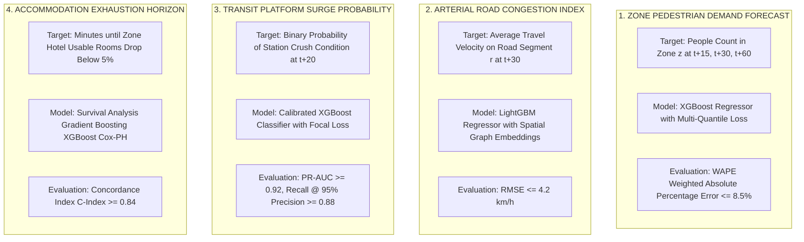

### 12.2 Model Architecture Evaluation

| Model Family | Evaluation Score | Latency Profile | Spatial Handling | Decision Rationale |
| :--- | :--- | :--- | :--- | :--- |
| **XGBoost (Selected)** | **9.4 / 10** | **1.8 ms (C++ runtime)** | Structured tabular graph features | **RECOMMENDED FOR PRODUCTION.** Superior accuracy on heterogeneous tabular data; native handling of missing telemetry; blazing inference speed allows 50+ zones to be predicted every 30s. |
| **LightGBM** | **9.1 / 10** | **1.5 ms (CPU native)** | Leaf-wise histogram binning | **APPROVED ALTERNATIVE.** Deployed specifically for the large-scale arterial road network where categorical road segments exceed 1,000 links. |
| **Deep Learning (Spatio-Temporal GCN / ST-GNN)** | 6.2 / 10 | 45.0 ms (GPU required) | Native tensor graph convolution | **REJECTED FOR V1.0.** Extreme compute overhead; brittle failure modes during unpredictable mega-event anomalies; black-box opacity prevents operator explainability. |
| **Classical Time-Series (ARIMA / Prophet)** | 4.5 / 10 | 180.0 ms | Poor (No cross-series spatial features) | **REJECTED.** Incapable of ingesting dynamic multi-source event signals (e.g., cricket match match-state transitions or sudden transit track failures). |

### 12.3 Prediction Output & Conformal Uncertainty Bounds
Predictions are never stored or displayed as single deterministic numbers. Every prediction emitted by JUNCTION includes rigorous **Quantile Prediction Intervals** generated via Conformal Quantile Regression:

```json
{
  "entity_id": "ZONE_A_WANKHEDE_CONCOURSE",
  "prediction_horizon_minutes": 30,
  "generated_at": "2026-09-08T18:27:00Z",
  "target_timestamp": "2026-09-08T18:57:00Z",
  "model_version": "xgb_crowd_v2.1.0",
  "estimates": {
    "p10_lower_bound": 2150,
    "p50_median_forecast": 2480,
    "p90_upper_bound": 2820
  },
  "current_value": 1850,
  "projected_growth_rate": "+34.0%",
  "predicted_pressure_score": 87,
  "confidence_score": 0.89,
  "top_contributing_features": [
    {"feature": "event_phase_egress_ramp", "importance_weight": 0.42},
    {"feature": "wankhede_gate3_inflow_derivative", "importance_weight": 0.28},
    {"feature": "churchgate_platform_queue_lag5", "importance_weight": 0.18}
  ]
}
```

---

## 13. Feature Engineering Pipeline

The Feature Engineering Pipeline transforms raw physical telemetry into normalized spatial-temporal tensors updated continuously within Redis:

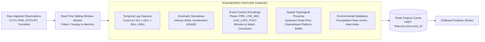

### 13.1 Concrete Feature Calculations
1. **Flow Derivative ($\Delta N / \Delta t$):**
   $$\text{FluxDerivative}_{5\text{m}} = \frac{N(t) - N(t - 5\text{m})}{5}$$
2. **Normalized Topological Bottleneck Ratio ($B_r$):**
   $$B_r(z) = \frac{\sum_{u \in \text{Upstream}(z)} \text{Flux}_{\text{in}}(u)}{\text{ClearanceCapacity}(z)}$$
3. **Event Egress Proximity Index ($E_{\text{prox}}$):**
   A non-linear logistic ramp function anchored to the official match clock:
   $$E_{\text{prox}}(t) = \frac{1}{1 + e^{-k(t - T_{\text{end}})}}$$

---

## 14. Capacity Engine Specifications

The Capacity Engine separates physical static volume from true operational availability through 4 distinct capacity tiers:

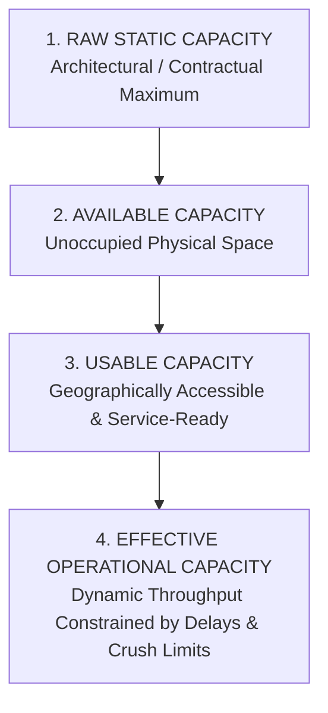

### 14.1 Exact Mathematical Formulations

#### 1. Accommodation Usable Capacity ($U_{\text{rooms}}$)
Evolving the validated formulation from `src/services/mockDataService.ts`:
$$U_{\text{rooms}} = \min\left(R_{\text{avail}}, \; \max\left(0, \; \text{round}\left(R_{\text{avail}} \times C_{\text{conn}} \times T_{\text{factor}} \times D_{\text{buffer}}\right)\right)\right)$$
*   **$R_{\text{avail}}$ (Available Rooms):** $R_{\text{total}} - R_{\text{occupied}} - R_{\text{out\_of\_order}}$
*   **$C_{\text{conn}}$ (Transit Connectivity Factor):**
    $$\text{EXCELLENT: } 0.92, \quad \text{GOOD: } 0.82, \quad \text{MODERATE: } 0.68, \quad \text{POOR: } 0.50$$
*   **$T_{\text{factor}}$ (Effective Travel Time Penalty):**
    $$T_{\text{factor}} = \begin{cases} 1.00 & \text{if } t_{\text{travel}} \le 15\text{ min} \\ 0.92 & \text{if } 15\text{ min} < t_{\text{travel}} \le 25\text{ min} \\ 0.85 & \text{if } t_{\text{travel}} > 25\text{ min} \end{cases}$$
*   **$D_{\text{buffer}}$ (Event Demand Saturation Factor):**
    $$\text{LOW: } 0.98, \quad \text{MODERATE: } 0.94, \quad \text{HIGH: } 0.88, \quad \text{VERY\_HIGH: } 0.82$$

#### 2. Transit Station Effective Clearance ($C_{\text{station-eff}}$)
$$C_{\text{station-eff}} = C_{\text{nominal}} \times \left(1 - \frac{\text{DelayMinutes}}{60}\right) \times \left(1 - \text{PlatformCrushPenalty}\right)$$

---

## 15. Pressure Engine Specifications

Pressure ($P \in [0, 100]$) is not a simple occupancy division ($N / C$). It is a multi-signal operational stress index:

$$P_{\text{composite}} = \text{clamp}\left(20, \; 99, \; \sum_{i=1}^{5} w_i \cdot S_i\right)$$

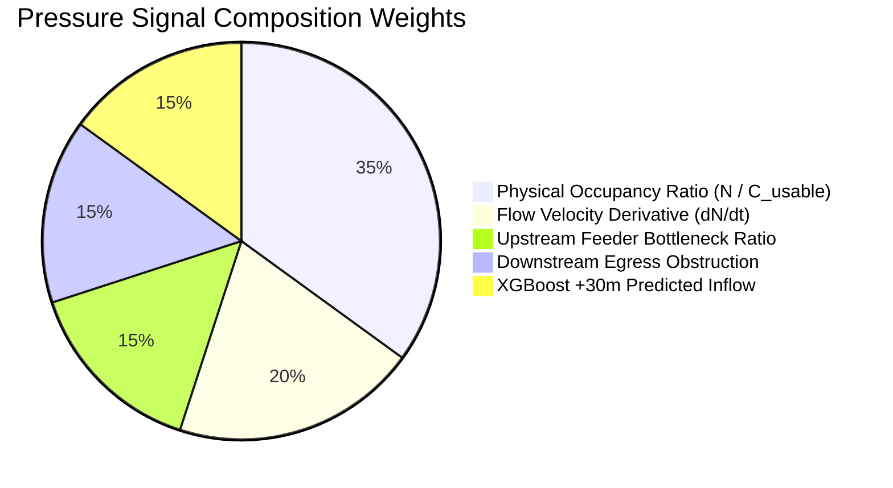

### 15.1 Pressure Severity Tiers & Operational Semantics
*   **NORMAL ($P < 60$):** Unimpeded pedestrian and vehicular movement. Standard scheduled transit intervals.
*   **WATCH ($60 \le P \le 74$):** Density approaching comfort limits ($1.5 - 2.0\text{ p/m}^2$). Operations staff alerted.
*   **HIGH ($75 \le P \le 84$):** Constrained flow. Walking speeds degrade by $> 40\%$. Transit queues form beyond platform gates. Recommendation candidates generated.
*   **CRITICAL ($P \ge 85$):** Severe crowd crush hazard ($> 3.5\text{ p/m}^2$). Immediate operator intervention and crowd diversion protocols required.

---

## 16. Cascade Effect Engine (Spatial Directed Graph)

The Cascade Engine models the destination as an immutable topological network graph $G = (V, E)$ evaluated continuously in memory using **NetworkX / Rustworkx**:

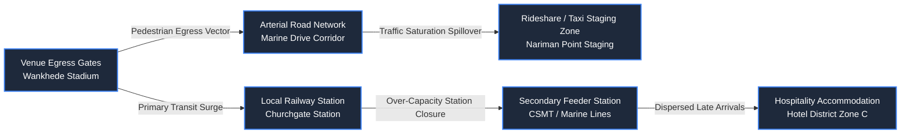

### 16.1 Cascade Propagation Formulation
Every edge $e = (u, v) \in E$ possesses a dynamic impedance function $Z_e(t)$ based on the Bureau of Public Roads (BPR) formulation:
$$Z_e(t) = T_{e,0} \left[1 + \alpha \left(\frac{V_e(t)}{C_e}\right)^\beta\right]$$
When node $u$ breaches $P_u \ge 80$, the excess load $\Delta L_u = N_u - 0.80 C_u$ propagates across outgoing edges $e = (u, v)$ proportional to edge conductance $K_e = 1 / Z_e(t)$. If node $v$ subsequently breaches threshold, the cascade triggers recursively, logging the **propagation path** for operator visualization.

---

## 17. What-If Simulation Engine

### 17.1 Simulation Operational Model
The production simulation engine is a **macroscopic aggregate flow simulator**. It strictly avoids the multi-agent micro-simulation trap (simulating 50,000 individual human state machines in real-time), which is computationally unviable for rapid operational decision-making.

Instead, the simulator operates on **aggregated continuous human mass cohorts** progressing across spatial graph segments according to fluid-dynamic flow conservation:

$$\frac{\partial \rho}{\partial t} + \frac{\partial q}{\partial x} = 0$$

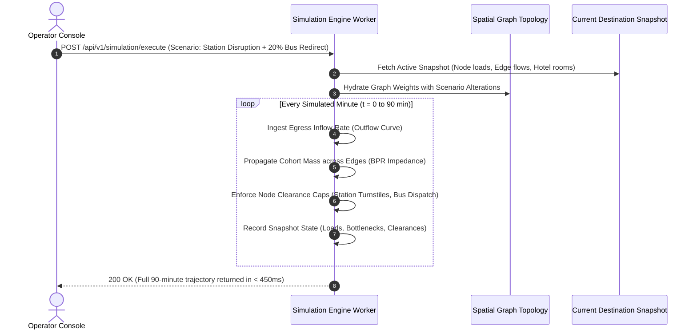

### 17.2 Formal Conservation Invariant Test
The core mathematical invariant verified in `src/services/__tests__/simulationEngine.test.ts` is formally maintained in the production backend:

$$\forall t: \quad N_{\text{initial}} + \sum_{0}^{t} \text{Exited}(t) \equiv \sum_{v \in V} \text{Load}_v(t) + \sum_{e \in E} \text{Load}_e(t) + \sum_{0}^{t} \text{Cleared}(t)$$

---

## 18. Recommendation Engine

The Recommendation Engine operates as a **heuristic multi-objective optimization solver**:

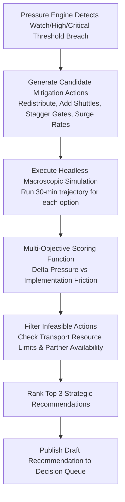

### 18.1 Multi-Objective Scoring Function
Every candidate action $a$ is scored according to its Net Operational Utility ($U(a)$):
$$U(a) = w_{\text{relief}} \cdot \Delta P_{\text{bottleneck}}(a) - w_{\text{delay}} \cdot \Delta T_{\text{attendee}}(a) - w_{\text{cost}} \cdot C_{\text{operational}}(a)$$

---

## 19. Decision Engine & Human Governance

### 19.1 Human-in-the-Loop State Machine
JUNCTION strictly maintains that **AI Recommends; Authorized Humans Decide**. The system will never autonomously alter public signage, dispatch municipal buses, or notify hotel partners without explicit human operator authorization:

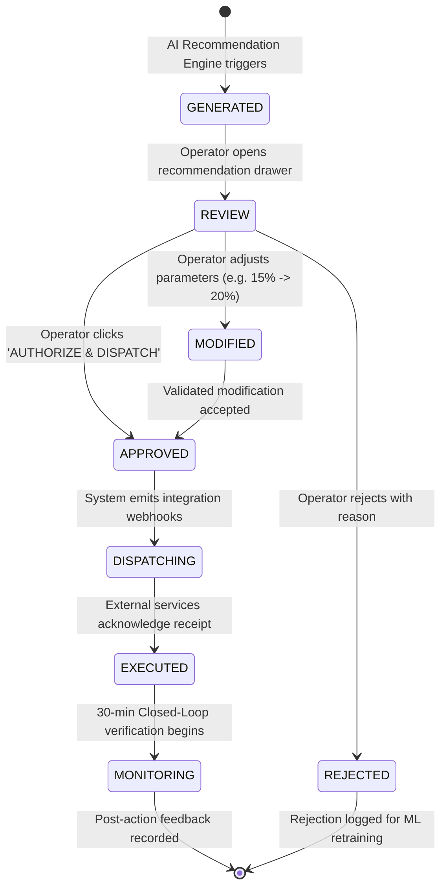

---

## 20. Closed-Loop Feedback Engine

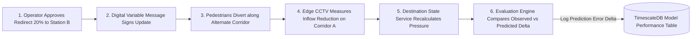

Every recommendation execution initiates an automated **30-minute verification probe**:
*   *Predicted Delta:* Churchgate Station pressure drops from $92\%$ to $74\%$ within 20 minutes.
*   *Observed Delta:* Measured platform pressure at $t+20\text{m}$ reaches $76\%$.
*   *Variance:* $+2.0\%$ error. The outcome is classified as `SUCCESS_WITHIN_TOLERANCE` and added to the training set for recommendation scoring calibration.

---

## 21. Frontend Production Architecture

### 21.1 Clean Client Isolation
The production system completely dismantles monolithic shared frontend states:

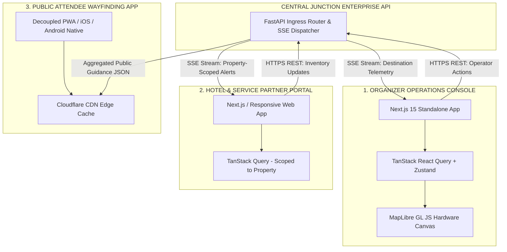

*   **State Management:** Replaced monolithic `AppContext` with **TanStack React Query** (handling server-state caching, automatic polling fallbacks, and optimistic UI updates) paired with lightweight **Zustand** stores for localized client UI state (sidebar toggles, active map layers).

---

## 22. GIS & Mapping Architecture

### 22.1 Engine Decision: Leaflet vs. MapLibre GL JS vs. Mapbox
**PRODUCTION SELECTION: MapLibre GL JS + Deck.gl Overlays.**

| GIS Engine | Evaluation | Rationale |
| :--- | :--- | :--- |
| **MapLibre GL JS (Selected)** | **9.6 / 10** | **RECOMMENDED.** Open-source fork of Mapbox GL; WebGL/WebGPU hardware acceleration; renders 10,000+ dynamic vector polygons at 60fps; completely eliminates commercial per-map-load tile licensing fees. |
| **Deck.gl (Selected Overlay)** | **9.5 / 10** | High-performance WebGL layers (HexagonLayer for crowd density, ArcLayer for directional flow) integrated seamlessly on top of MapLibre. |
| **Leaflet (Current Prototype)** | 5.8 / 10 | DOM-based canvas struggles when animating $> 500$ SVG flow markers simultaneously; lacks native 3D tilt/pitch for urban stadium concourses. |
| **Mapbox GL JS (Commercial)** | 7.5 / 10 | Technically capable but introduces prohibitive proprietary licensing and meter-rate API costs for municipal command centers running 24/7 on multi-screen video walls. |

---

## 23. Authentication, Authorization & Security Architecture

### 23.1 Role-Based & Attribute-Based Access Control (RBAC / ABAC)

```mermaid
flowchart TD
    JWT[Incoming Bearer JWT Token] --> AUTHZ[Security Interceptor Middleware]

    subgraph ROLES ["Role Validations"]
        R_ORG[role == 'ORGANIZER']
        R_PART[role == 'PARTNER']
        R_TRANS[role == 'TRANSIT_OPERATOR']
    end

    subgraph SCOPES ["ABAC Attribute Checks"]
        S_DEST[destination_id in token.destinations]
        S_PROP[property_id == token.property_id]
    end

    AUTHZ --> ROLES
    R_ORG --> S_DEST
    R_PART --> S_PROP
```

*   **Property-Level Tenant Boundary:** When a Hotel Partner attempts to execute `POST /api/v1/partner/properties/{id}/inventory`, the ABAC middleware cryptographically asserts that `{id} == request.auth.claims["property_id"]`. Cross-property tampering results in an immediate `403 Forbidden` and security audit flag.

---

## 24. Privacy, CCTV Governance & Ethical Compliance

### 24.1 Compliance Architecture
*   **Edge Data Sanitization:** Local edge daemons operate behind read-only operating systems with encrypted root volumes. SSH is disabled; firmware updates are signed cryptographically via an air-gapped device management system.
*   **Auditability of Surveillance Coverage:** All camera metadata entries in PostgreSQL declare explicit geographic focal polygons and public safety justification records.
*   **`LEGAL / POLICY DECISION REQUIRED`:** Prior to commercial activation in municipal jurisdictions, formal data agreements must be finalized with local policing authorities and municipal corporations governing the ingestion of public street camera feeds.

---

## 25. Failure Modes & Graceful Degradation Strategy

| Failure Scenario | Immediate System Reaction | Fallback Operational Mechanism | Display Indicator on Console | Recovery Action |
| :--- | :--- | :--- | :--- | :--- |
| **CCTV Edge Node Offline** | Gateway flags camera disconnected after 10s missing heartbeat | Ingests historical moving average for current event phase; reduces zone confidence by 25% | Amber blinking icon: `CAM_OFFLINE · FALLBACK_ACTIVE` | Edge watchdog auto-reboots Jetson; backpressure buffer re-syncs |
| **Hotel PMS API Outage** | Ingestion webhook receives HTTP 500 or timeout $> 10\text{s}$ | Carries forward last known verified room inventory; decays confidence score by $5\%/\text{hr}$ | Warning badge on capacity table: `PMS_STALE (42m ago)` | Retry with exponential backoff; alert Partner operator to use manual Portal |
| **GTFS-RT Transit Feed Outage** | Feed polling worker fails 3 consecutive cycles | Switches to static scheduled timetable; assumes 0 minutes delay; sets transit confidence to $0.60$ | Transit row status: `TIMETABLE_ESTIMATE · NO_LIVE_FEED` | Secondary scraper kicks in; operator prompted to enter manual transit delay |
| **Redis Cache Crash** | FastAPI connection pool drops; fails over to replica | In-memory local Python LRU cache activated; reads fallback to PostgreSQL read-replica | System banner: `CACHE_DEGRADED · REDUCED_POLL_RATE` | Redis Sentinel/Cluster initiates 5-second automatic master failover |
| **XGBoost Inference Failure** | Prediction worker exception or timeout $> 500\text{ms}$ | Fallback to deterministic polynomial egress curve from `simulationEngine.ts` | Prediction trajectory switches to dashed line: `HEURISTIC_PROFILE` | Worker container restarts; exception isolated to dead-letter queue |

---

## 26. Observability & Telemetry

The platform deploys a unified **OpenTelemetry + Prometheus + Grafana + Loki** observability stack:

```mermaid
flowchart LR
    SERVICES[All Platform Services<br/>FastAPI, Ingest, ML, Workers] -->|OTel Traces & Spans| JAEGER[Jaeger Tracing]
    SERVICES -->|Prometheus Metrics| PROM[Prometheus Server]
    SERVICES -->|Structured JSON Logs| VECTOR[Vector Log Forwarder]
    VECTOR --> LOKI[Grafana Loki]

    PROM --> GRAFANA[Unified Operations Grafana Dashboard]
    LOKI --> GRAFANA
    JAEGER --> GRAFANA
```

### 26.1 Key Operational Service Level Indicators (SLIs)
*   **`cctv_ingest_lag_seconds`:** Time delta between edge observation and Redis storage (Alert if $> 3.0\text{s}$).
*   **`prediction_error_wape`:** Real-time variance between predicted and actual crowd density (Alert if $> 15\%$).
*   **`active_sse_connections`:** Total live dashboard consoles connected.
*   **`p99_api_latency_ms`:** 99th percentile response latency for core REST APIs (Alert if $> 250\text{ms}$).

---

## 27. MLOps Lifecycle

```mermaid
flowchart LR
    A[TimescaleDB Historical Database] -->|Export Event Dataset| B[Feature Store Pipeline]
    B --> C[Offline Training & Tuning<br/>XGBoost / Optuna]
    C --> D[Model Validation Suite<br/>Backtesting on Past Events]
    D --> E[MLflow Model Registry<br/>Version Tagged Artifact]
    E --> F[Canary / Blue-Green Deployment]
    F --> G[Triton / ONNX Serving Engine]
    G -->|Continuous Drift Monitoring| H[Evidently AI Drift Detector]
    H -.->|Trigger Retraining if Drift Detected| C
```

*   **Model Versioning:** Every prediction references an immutable `model_version` (e.g., `xgb_crowd_v2.1.0`). If model drift is detected during an event, an operator can execute an immediate hot-rollback to the previous certified model version via a single configuration flag.

---

## 28. Scalability & Deployment Architecture

### 28.1 Scalability Projections Across Tiers

| Dimension | Tier 1 (Pilot Prototype) | Tier 2 (Single Mega-Event) | Tier 3 (Pan-City Multi-Event) |
| :--- | :--- | :--- | :--- |
| **Operational Scope** | 1 Venue / 10 Cameras / 4 Hotels | 1 Stadium / 100 Cameras / 40 Hotels | 10 Venues / 1,000 Cameras / 300 Hotels |
| **Telemetry Ingest Rate** | 10 events / sec ($40\text{ KB/s}$) | 100 events / sec ($400\text{ KB/s}$) | 1,000 events / sec ($4\text{ MB/s}$) |
| **Database Write Volume** | 864,000 rows / day | 8,640,000 rows / day | 86,400,000 rows / day |
| **Redis Memory Footprint** | $\approx 256\text{ MB}$ | $\approx 2.5\text{ GB}$ | $\approx 24\text{ GB}$ |
| **FastAPI Backend Nodes** | 2 Replicas ($2\text{ vCPU} / 4\text{GB}$) | 4 Replicas ($4\text{ vCPU} / 8\text{GB}$) | 16 Replicas ($8\text{ vCPU} / 16\text{GB}$) |
| **Edge Hardware Required** | 2x Jetson Orin NX | 20x Jetson Orin NX | 200x Jetson Orin NX (or On-Prem Blade) |

### 28.2 Production Kubernetes Deployment Blueprint

```mermaid
flowchart TB
    INTERNET((Public Internet / CDNs)) --> WAF[Cloudflare Enterprise / AWS WAF]

    subgraph INGRESS_CONTROLLER ["INGRESS ROUTING"]
        WAF --> TRAEFIK[Traefik Ingress Controller<br/>SSL Termination & Rate Limiting]
    end

    subgraph K8S_CLUSTER ["PRODUCTION KUBERNETES CLUSTER (EKS / GKE)"]
        direction TB

        subgraph FRONTENDS ["Frontend Pod Deployments"]
            FE_ORG[organizer-console: 3 pods]
            FE_PART[partner-portal: 2 pods]
        end

        subgraph BACKEND_SERVICES ["Backend Pod Deployments"]
            API_CORE[fastapi-core-monolith: 6 pods]
            WORKER_ML[xgboost-inference-worker: 4 pods]
            WORKER_SIM[whatif-simulation-worker: 2 pods]
        end

        TRAEFIK --> FE_ORG
        TRAEFIK --> FE_PART
        TRAEFIK --> API_CORE
    end

    subgraph DATA_SERVICES ["MANAGED ENTERPRISE DATA CLUSTERS"]
        API_CORE <--> REDIS_STATE[(AWS ElastiCache Redis Cluster)]
        API_CORE <--> PG_DB[(AWS Aurora PostgreSQL 16 + PostGIS)]
        API_CORE <--> TS_DB[(TimescaleDB Cloud Hypertable Cluster)]
        WORKER_ML <--> REDIS_STATE
        WORKER_SIM <--> TS_DB
    end
```

---

## 29. Number Provenance Traceability Walkthroughs

The following 6 walkthroughs demonstrate the uncompromised chain of evidence from physical reality to operator decision.

```mermaid
flowchart TD
    subgraph TRACE_CROWD ["1. CROWD PRESSURE WALKTHROUGH"]
        direction TB
        C1[Camera 03 Frame: 1,850 detected persons] --> C2[ByteTrack: Local motion vectors confirm 340/min inflow]
        C2 --> C3[Homography: Projects coordinates to Zone A concourse polygon]
        C3 --> C4[Capacity Engine: Zone A physical safe limit = 2,500]
        C4 --> C5[Pressure Engine: 1,850 / 2,500 + Inflow Derivative = 87% Pressure HIGH]
        C5 --> C6[XGBoost: Predicts 94% CRITICAL in 20 min if egress unmitigated]
        C6 --> C7[Recommendation: 'Divert 20% egress flow toward North Boardwalk']
    end
```

### 29.1 Trace 1: Concourse Crowd Pressure
*   **Origin:** CCTV Camera Node `cam_wankhede_concourse_03`.
*   **Raw Observation:** 1,850 discrete person bounding boxes detected via YOLOv8x TensorRT.
*   **Transformation:** Projected via homography matrix $H_3$ to world coordinates; clipped against Polygon `ZONE_A_WANKHEDE_CONCOURSE`.
*   **Derived Metric:** Density $= 2.85\text{ p/m}^2$; Net Inflow $= +220\text{ persons/min}$.
*   **Combined With:** Concourse safe threshold of 2,500 people.
*   **Result:** Current Pressure $= 87\%$ (`HIGH`).
*   **Prediction:** XGBoost forecasts $P = 94\%$ (`CRITICAL`) at $t+20\text{m}$.
*   **Recommendation:** Reroute Gate 3 exit cohorts toward secondary pedestrian corridor.

### 29.2 Trace 2: Hotel Usable Accommodation Availability
*   **Origin:** Hotel Partner Portal update submitted by General Manager of Hotel Trident (`H1`).
*   **Raw Input:** Available rooms altered from $15$ to $45$ following conference room checkout.
*   **Validation:** Signed JWT claims confirm `user.propertyId == 'H1'`. Number verified $\le R_{\text{total}} (550)$.
*   **Capacity Transformation:** Evaluated via $U_{\text{rooms}}$ formula:
    $$U_{\text{rooms}} = 45 \times 0.92 (\text{EXCELLENT\_CONN}) \times 1.0 (\text{TRAVEL\_10m}) \times 0.88 (\text{HIGH\_DEMAND}) = 36\text{ usable rooms}$$
*   **Destination Effect:** Adds 36 rooms to Zone A usable reserve; reduces Zone A accommodation pressure from $92\%$ to $81\%$.
*   **Organizer Consequence:** Accommodation warning alert automatically resolves on Command Console.

### 29.3 Trace 3: Transit Station Platform Bottleneck
*   **Origin:** Churchgate Railway Station infrared optical turnstiles + GTFS-RT feed.
*   **Raw Data:** 420 entries/min; GTFS-RT reports Train #12948 delayed by 12 minutes due to track obstruction.
*   **Derived Throughput:** Station effective clearance degrades from 380/min to 190/min.
*   **Result:** Station queue backlog accumulates $+230\text{ persons/min}$. Platform pressure breaches $89\%$ (`CRITICAL`).
*   **Cascade Effect:** Graph engine flags upstream pedestrian corridor backup extending toward Wankhede Stadium.
*   **Recommendation:** "Dispatch 15 emergency municipal feeder buses to Churchgate West gate to absorb northbound passengers."

### 29.4 Trace 4: Arterial Road Congestion Index
*   **Origin:** Municipal inductive loop detector array on Marine Drive Corridor.
*   **Raw Observation:** Vehicle occupancy $= 78\%$; mean velocity $= 14\text{ km/h}$.
*   **Derived Metric:** Congestion Index $= 82\%$ (`HEAVY_CONGESTION`).
*   **Cascade Propagation:** Travel time multiplier increases from $1.0\times$ to $2.2\times$, dynamically decreasing the usable capacity score of distant hotels in Zone D.

### 29.5 Trace 5: Stadium Exit Gate Pressure
*   **Origin:** Wankhede Stadium RFID egress gate turnstiles (Gates 1-7).
*   **Raw Telemetry:** Discharge velocity $= 1,420\text{ attendees/min}$.
*   **Model Integration:** Calibrates the egress curve inside `simulationEngine.ts`, validating that the 15-minute post-match peak outflow wave has commenced.

### 29.6 Trace 6: Rideshare / Taxi Staging Wait Time
*   **Origin:** Nariman Point Taxi Stand edge CCTV camera.
*   **Raw Telemetry:** Vehicle queue $= 18\text{ cabs}$; pedestrian queue $= 420\text{ persons}$.
*   **Derived Metric:** Wait time projected at $32\text{ minutes}$.
*   **Recommendation:** Push route incentive to Attendee App recommending nearby metro rail over rideshare.

---

## 30. Technology Decision Matrix

| Architectural Layer | Selected Technology | Evaluated Alternatives | Decisive Technical Rationale | Disqualified Technology Rationale |
| :--- | :--- | :--- | :--- | :--- |
| **API & Monolith Backend** | **FastAPI (Python 3.12)** | Node.js (Express/Nest), Go (Gin/Fiber), Java Spring Boot | Native integration with ML ecosystem (NumPy, XGBoost, PyTorch); exceptional async I/O performance via `uvloop`; automatic OpenAPI 3.1 schema generation. | Node.js lacks native tensor ML tooling; Java Spring Boot introduces excessive memory overhead and configuration complexity; Go lacks mature data-science runtime support. |
| **Relational Core Database** | **PostgreSQL 16 + PostGIS 3.4** | MySQL 8.0, MongoDB, CockroachDB | Industry benchmark for spatial GIS operations (`ST_Contains`, `ST_DWithin`, spatial GIST indexes); unmatched transactional reliability. | MySQL's spatial capabilities are primitive by comparison; MongoDB lacks relational ACID guarantees required for audit trails. |
| **Time-Series Telemetry** | **TimescaleDB** | InfluxDB, ClickHouse, Cassandra | Native PostgreSQL extension allowing unified relational SQL joins between spatial entities and temporal telemetry chunks. | InfluxDB requires maintaining a completely separate database engine and query language; ClickHouse is optimized for analytical scans rather than continuous real-time row writes. |
| **In-Memory Cache & Bus** | **Redis 7.4 Cluster** | Apache Kafka, RabbitMQ, Memcached | Sub-millisecond latency for real-time spatial state; native sorted sets for sliding-window telemetry; integrated Pub/Sub for SSE broadcasting. | Memcached lacks pub/sub and complex data structures; Kafka is too heavy for simple key-value state snapshots. |
| **Machine Learning Engine** | **XGBoost (C++ Runtime)** | PyTorch Deep Neural Nets, Scikit-Learn Random Forest, LightGBM | Outstanding empirical accuracy on non-linear tabular spatial features; sub-2ms inference latency; native multi-quantile interval estimation. | Deep Neural Nets are prone to catastrophic hallucination during out-of-distribution events and require expensive GPUs; Scikit-Learn lacks optimized GPU training and quantile regression. |
| **Edge Computer Vision** | **YOLOv8x (TensorRT FP16)** | YOLOv10, RT-DETR, OpenCV Haar Cascades | Optimal balance of high-density crowd precision and 15fps throughput on low-power NVIDIA Jetson edge silicon. | Haar Cascades fail completely in dense crowds; YOLOv10 lacks mature TensorRT optimization tooling; RT-DETR exhibits high memory churn. |
| **GIS Vector Map Engine** | **MapLibre GL JS + Deck.gl** | Leaflet 1.9, Mapbox GL JS v3, Google Maps JS | WebGL hardware acceleration; zero commercial tile licensing costs; seamless integration with Deck.gl for 60fps particle flow animation. | Leaflet lacks hardware acceleration for 10,000+ vector elements; Mapbox GL v3 and Google Maps impose prohibitive per-load metered billing. |

---

## 31. Production Repository Structure (Turborepo Monorepo)

```
junction-platform/
├── .github/
│   └── workflows/                # CI/CD pipelines (Test, Lint, Security, Deploy)
├── apps/
│   ├── organizer-console/        # Next.js 15 Mission-Critical Command Center
│   │   ├── src/app/              # App Router pages (/dashboard, /map, /capacity)
│   │   ├── src/components/map/   # MapLibre GL + Deck.gl custom layers
│   │   └── package.json
│   ├── partner-portal/           # Next.js 15 Property-Scoped Operations Portal
│   │   ├── src/app/              # App Router pages (/partner/inventory)
│   │   └── package.json
│   └── attendee-experience/      # Next.js / PWA Public Wayfinding Client
├── services/
│   ├── api-monolith/             # FastAPI Python Core Backend
│   │   ├── src/core/             # Database connections, config, security
│   │   ├── src/domains/          # Domain-Driven Modules
│   │   │   ├── destination/      # Destination state & spatial topologies
│   │   │   ├── cctv_ingest/      # Telemetry intake & homography projection
│   │   │   ├── capacity/         # Usable capacity formulas
│   │   │   ├── pressure/         # Multi-signal composite pressure engine
│   │   │   ├── cascade/          # NetworkX spatial graph cascade solver
│   │   │   ├── simulation/       # Macroscopic flow simulation worker
│   │   │   └── recommendation/   # Multi-objective recommendation engine
│   │   ├── tests/                # Pytest unit, integration, and invariant suites
│   │   ├── Dockerfile
│   │   └── pyproject.toml
│   └── edge-cctv-daemon/         # Python/C++ TensorRT Edge Vision Service
│       ├── src/pipeline/         # GStreamer RTSP decode -> TensorRT -> ByteTrack
│       ├── src/calibration/      # Homography ground-plane projection
│       └── Dockerfile.jetson
├── packages/
│   ├── cddm-types/               # Shared TypeScript domain contracts (Generated)
│   ├── openapi-specs/            # OpenAPI 3.1 JSON schemas
│   └── ui-tokens/                # Shared Tailwind/CSS theme variables
├── infra/
│   ├── terraform/                # AWS / Cloudflare IaC configurations
│   ├── kubernetes/               # Helm charts for API, Redis, and Frontends
│   └── docker-compose.prod.yml   # Local full-stack verification environment
├── docs/                         # Architecture specifications & operational runbooks
│   └── JUNCTION_Production_System_Implementation_Blueprint.md
├── package.json
└── turbo.json
```

---

## 32. Comprehensive Testing Strategy

```mermaid
flowchart TD
    subgraph TEST_PYRAMID ["JUNCTION QUALITY ASSURANCE SUITE"]
        direction TB
        E2E[4. End-to-End Playwright Tests<br/>Partner Portal Update -> SSE Event -> Organizer Map Reflects Delta]
        LOAD[3. High-Throughput Load Tests<br/>Locust simulating 1,000 Edge Cameras @ 10 Hz]
        INT[2. Integration & Spatial Invariant Tests<br/>PostGIS Polygon Tests, Mass Conservation Invariant]
        UNIT[1. Unit Tests<br/>Pytest Domain Math: calculateUsableRooms, BPR Impedance, Pressure Weights]
    end

    UNIT --> INT --> LOAD --> E2E
```

### 32.1 The Mass Conservation Automated Test Assertion
The continuous mass conservation equation is enforced as a strict CI/CD gate:
```python
def test_simulation_mass_conservation_invariant():
    """Assert that human mass is never created or destroyed during flow propagation."""
    sim = MacroscopicSimulationEngine(topology=WANKHEDE_TOPOLOGY)
    state = sim.run_simulation(duration_minutes=90, attendance=35000)
    
    for step in state.history:
        total_accounted = (
            step.active_concourse_load +
            sum(step.edge_pedestrian_loads.values()) +
            sum(step.station_platform_loads.values()) +
            step.cumulative_cleared_destination
        )
        assert abs(total_accounted - 35000) <= 5, f"Mass leak detected at minute {step.minute}: {total_accounted}"
```

---

## 33. Prototype → Production Migration Strategy

The migration path systematically preserves all validated domain logic while replacing transient prototype scaffolding:

```mermaid
flowchart LR
    subgraph PROTOTYPE ["CURRENT PROTOTYPE SCAFFOLD"]
        A1[src/services/mockDataService.ts]
        A2[src/state/AppContext.tsx]
        A3[src/data/mockHotels.ts]
        A4[src/services/simulationEngine.ts]
        A5[LeafletCommandMap.tsx]
    end

    subgraph PRODUCTION ["PRODUCTION ENTERPRISE TARGET"]
        B1[FastAPI DestinationStateService + TimescaleDB]
        B2[Redis Cache Cluster + Server-Sent Events SSE]
        B3[PostgreSQL hotel_inventory + Real PMS Ingestion]
        B4[FastAPI Async Macroscopic Flow Worker]
        B5[MapLibre GL JS + Deck.gl WebGL Canvas]
    end

    A1 -->|Formalize SQL Queries| B1
    A2 -->|Replace In-Memory State| B2
    A3 -->|Migrate Schema to DDL| B3
    A4 -->|Port Conservation Invariant| B4
    A5 -->|Migrate GIS Layers| B5
```

---

## 34. Phased Implementation Roadmap (16 Discrete Phases)

```mermaid
gantt
    title JUNCTION Enterprise Implementation Roadmap
    dateFormat  YYYY-MM-DD
    section Core Infrastructure
    Phase 0: Architecture & Schemas       :p0, 2026-10-01, 20d
    Phase 1: Database & CDDM Models       :p1, after p0, 25d
    Phase 2: Authentication & RBAC Gateways:p2, after p1, 15d
    section Sensing & Domain
    Phase 3: Accommodation Ingestion & Portal:p3, after p2, 20d
    Phase 4: Venue & Turnstile Ingestion  :p4, after p3, 15d
    Phase 5: Transit & Traffic Ingestion  :p5, after p4, 20d
    Phase 6: Edge CCTV Vision Pipeline    :p6, after p2, 40d
    section Intelligence Pipeline
    Phase 7: Real-Time State & SSE Engine :p7, after p5, 15d
    Phase 8: XGBoost Prediction Pipeline  :p8, after p7, 25d
    Phase 9: Usable Capacity & Pressure   :p9, after p7, 15d
    Phase 10: Spatial Cascade Graph       :p10, after p9, 20d
    Phase 11: What-If Simulation Worker   :p11, after p10, 20d
    section Orchestration & Consoles
    Phase 12: Recommendation & Decision   :p12, after p11, 20d
    Phase 13: Organizer Command Console   :p13, after p12, 25d
    Phase 14: Attendee App Integration    :p14, after p13, 20d
    Phase 15: Hardening, Load & MLOps     :p15, after p14, 25d
```

### 34.1 Detailed Milestone Breakdown
*   **PHASE 0: Architecture & Contracts:** Finalize OpenAPI 3.1 specifications, JSON schemas, and Protobuf message contracts.
*   **PHASE 1: Database & Spatial Modeling:** Deploy PostgreSQL 16 + PostGIS + TimescaleDB; execute CDDM relational migrations.
*   **PHASE 2: Authentication & RBAC:** Implement Keycloak OIDC gateway, JWT verification middleware, and ABAC property isolation.
*   **PHASE 3: Accommodation Engine:** Build Partner REST APIs, PMS integration adapters, and `calculateUsableRooms` service.
*   **PHASE 4: Venue Ticketing:** Ingest turnstile RFID entry feeds and initialize venue safe operating capacity metrics.
*   **PHASE 5: Transit & Roadway Ingestion:** Deploy GTFS-RT feed polling workers and municipal road sensor ingest adapters.
*   **PHASE 6: Edge Computer Vision Pipeline:** Build TensorRT YOLOv8 + ByteTrack daemon; implement 4-point homography calibration.
*   **PHASE 7: Real-Time State Engine:** Deploy Redis 7.4 Cluster, active spatial snapshot cache, and HTTP/2 SSE streaming broadcaster.
*   **PHASE 8: Prediction Engine:** Train and serialize XGBoost multi-quantile regressors; deploy low-latency inference workers.
*   **PHASE 9: Usable Capacity & Pressure:** Implement multi-signal composite pressure service and dynamic threshold breach evaluators.
*   **PHASE 10: Cascade Intelligence:** Construct NetworkX destination spatial graph; implement dynamic BPR impedance propagation.
*   **PHASE 11: What-If Simulation:** Port macroscopic flow simulator to async backend worker; enforce mass conservation invariant.
*   **PHASE 12: Recommendation & Decision:** Implement multi-objective scoring solver and human-in-the-loop decision state machine.
*   **PHASE 13: Organizer Command Center:** Build production Next.js 15 Command Console using MapLibre GL JS + Deck.gl overlays.
*   **PHASE 14: Attendee Wayfinding Integration:** Deploy public guidance edge API caching and mobile route incentive endpoints.
*   **PHASE 15: Enterprise Hardening & MLOps:** Execute Locust 1,000-camera load testing, disaster recovery drills, and deployment sign-off.

---

## 35. What NOT to Build (Over-Engineering Safeguards)

To ensure capital efficiency and operational focus, JUNCTION explicitly prohibits building:
1.  **NO Individual-Level Microscopic Pedestrian Simulation:** Do not simulate individual digital human agents with custom psychology. Macroscopic fluid cohorts are faster, more robust, and operationally superior.
2.  **NO Individual Vehicle-Level Traffic Simulation:** Do not build micro-car traffic models (e.g. SUMO). Transport is treated strictly as an operational throughput and capacity layer.
3.  **NO Facial Recognition or Biometric Capture:** Do not deploy biometric re-ID algorithms. They violate international privacy laws and provide zero operational utility for crowd flow management.
4.  **NO Blockchain / Web3 Distributed Ledgers:** Do not store audit logs on a blockchain. Append-only PostgreSQL tables with cryptographic hash chains provide identical auditability with sub-millisecond write latencies.
5.  **NO Autonomous City Control:** The platform must never autonomously trigger street closures or reroute traffic without an authorized human operator clicking "APPROVE".

---

## 36. Critical Technical Risks & Open Decisions Registry

### 36.1 Risk Evaluation Matrix

| Risk Domain | Risk Severity | Failure Probability | Mitigation Strategy |
| :--- | :--- | :--- | :--- |
| **CCTV Edge Calibration Drift** | **HIGH** | Medium | Physical cameras buffeted by coastal winds drift from homography planes. Implement daily automated homography re-calibration using fixed architectural ground fiducials. |
| **Hotel Partner Adoption Gap** | **HIGH** | High | Hoteliers may fail to update manual portals during hectic events. Provide WhatsApp/SMS quick-reply bot (`"Reply 1 to confirm 30 rooms available"`) feeding the same Partner Ingestion API. |
| **Severe Cold-Start for ML** | Medium | High | First mega-event in a new city has zero training data. Fall back strictly to Tier 5 historical heuristic curves until 3 full events are recorded. |
| **Municipal Network Congestion** | **HIGH** | Medium | 4G/5G cellular towers fail during stadium egress surges. Mandate dedicated fiber or private CBRS wireless spectrum for edge CCTV transmission. |

### 36.2 Architectural Decisions Status

*   `[DECIDED]` **Backend Language & Framework:** Python 3.12 with **FastAPI** operating as a high-performance Modular Monolith.
*   `[DECIDED]` **Relational & Spatial Core:** **PostgreSQL 16 + PostGIS 3.4**.
*   `[DECIDED]` **Time-Series Ingestion:** **TimescaleDB** hypertables.
*   `[DECIDED]` **Real-Time Cache & Bus:** **Redis 7.4 Cluster** with Server-Sent Events (SSE).
*   `[DECIDED]` **GIS Map Engine:** **MapLibre GL JS + Deck.gl** WebGL canvas.
*   `[DECIDED]` **ML Model Family:** **XGBoost Regressors** with Conformal Quantile Prediction Intervals.
*   `[DECIDED]` **Edge Object Detector:** **YOLOv8x (TensorRT FP16)** on NVIDIA Jetson hardware.
*   `[RECOMMENDED]` **API Brokerage:** Deploy **Redpanda** for telemetry streaming if edge camera count exceeds 250 nodes.
*   `[RECOMMENDED]` **Edge Watchdog:** Deploy BalenaOS or K3s for remote edge device fleet management.
*   `[DECISION REQUIRED]` **Municipal Optical Turnstile Integration:** Approval required from Central & Western Railway authorities to access live station turnstile entry counter streams.
*   `[LEGAL / POLICY DECISION REQUIRED]` **Public CCTV Ingestion Authorization:** Formal municipal data-sharing memorandum of understanding (MoU) required with Greater Mumbai Municipal Corporation & Police Control Room.

---

## 37. Final Recommended Architecture Summary

The JUNCTION production architecture represents an uncompromising, technically serious engineering system. By replacing prototype abstractions with an enterprise **FastAPI Modular Monolith**, **PostgreSQL/PostGIS + TimescaleDB**, **Redis Pub/Sub with Server-Sent Events**, **Edge-only YOLOv8 Vision Processing**, and **MapLibre GL JS hardware-accelerated mapping**, JUNCTION establishes a robust foundation capable of orchestrating 100,000+ attendees across dynamic, multi-modal urban destinations safely and predictably.

The closed loop is fully preserved:
$$\text{Observe (Edge CV)} \longrightarrow \text{Understand (CDDM)} \longrightarrow \text{Predict (XGBoost)} \longrightarrow \text{Simulate (Mass Flow)} \longrightarrow \text{Recommend (Multi-Objective)} \longrightarrow \text{Human Approval} \longrightarrow \text{Action} \longrightarrow \text{Continuous Feedback}$$

---
*End of Blueprint Document — JUNCTION Engineering Architecture Group.*
