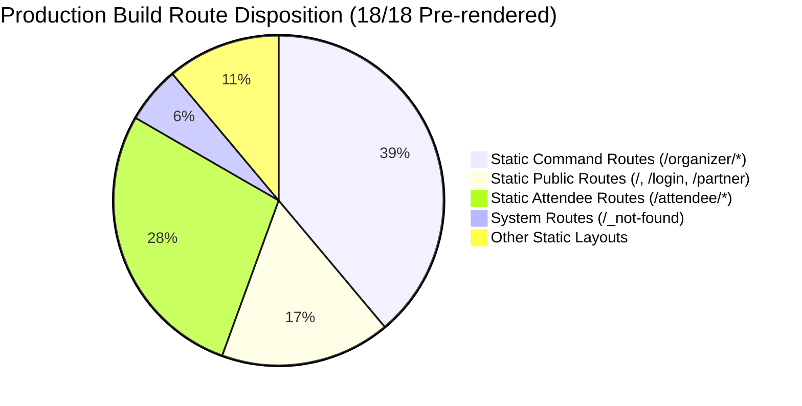
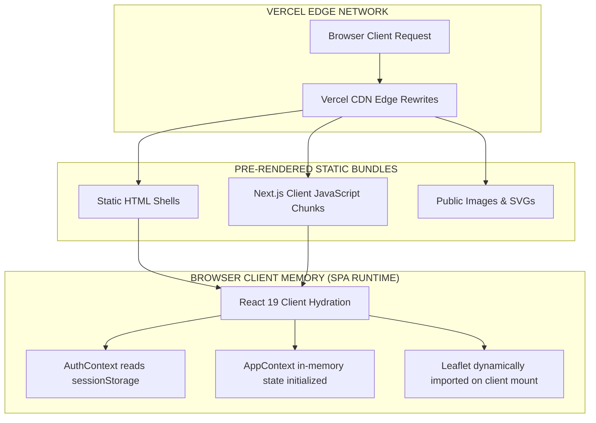
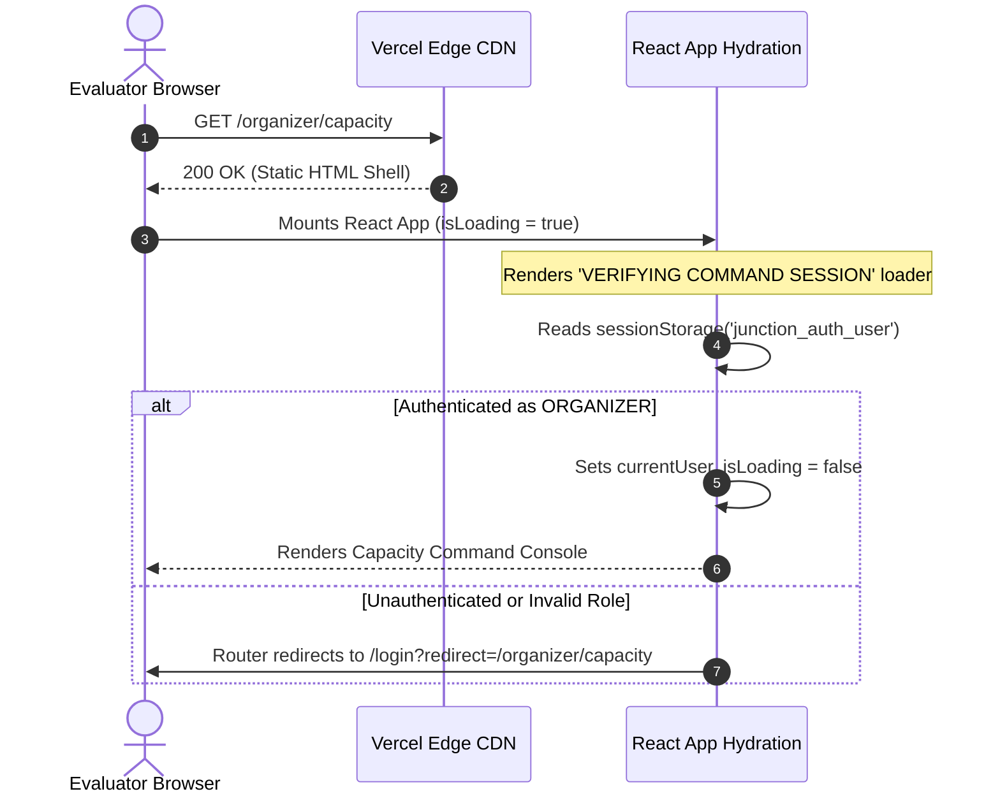
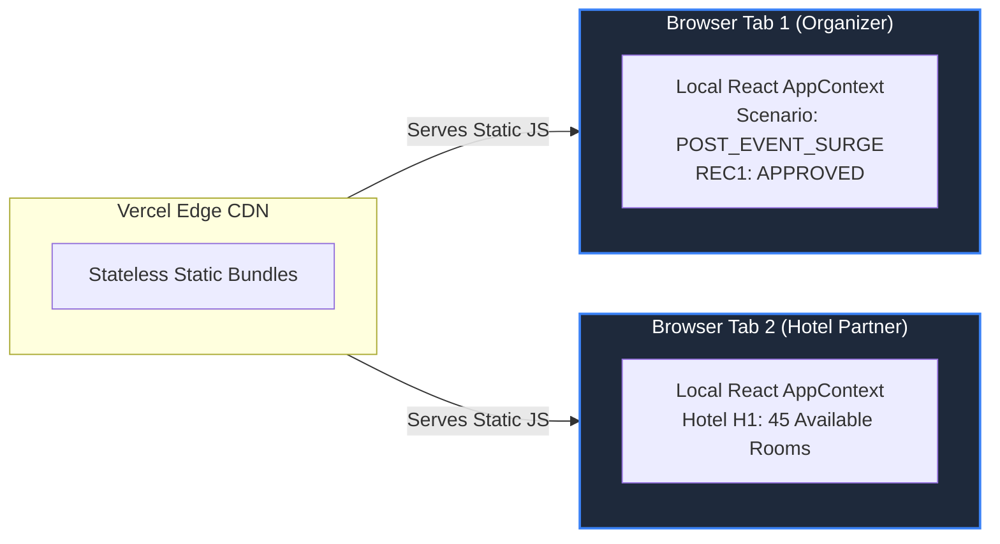

# JUNCTION — VERCEL DEPLOYMENT READINESS AUDIT
## Production Deployment Verification & Compatibility Report
**Document Version:** 1.0.0-AUDIT  
**Audit Target:** JUNCTION Hackathon Web Prototype  
**Target Platform:** Vercel (Edge Network / Serverless Runtime)  
**Framework Stack:** Next.js 16.3.4 (App Router) · React 19.2.8 · TypeScript 5 · Turbopack  
**Audit Date:** September 2026  
**Status:** Audit Complete · **VERDICT: READY TO DEPLOY**  

---

## 1. Executive Summary

### Deployment Verdict: **READY TO DEPLOY**
The current JUNCTION hackathon prototype is **100% structurally, architecturally, and syntactically compatible with Vercel**. 

A clean production build (`npm run build`) was executed and succeeded with:
*   **0 Build Errors**
*   **0 Type Errors**
*   **0 Routing / Pre-rendering Failures**
*   **18 of 18 Static Routes Successfully Pre-rendered**



### Key Verification Highlights
1. **Leaflet SSR Isolation:** The geographic map (`LeafletCommandMap`) is dynamically imported with `{ ssr: false }` inside `DestinationMap.tsx`. This completely neutralizes the notorious `window is not defined` failure mode during Vercel static pre-rendering.
2. **Zero Hardcoded Secrets or Backend Endpoints:** The repository contains zero localhost references (`127.0.0.1` / `localhost:3000`) and zero exposed secrets in tracked git files.
3. **Graceful Basemap Fallback:** `NEXT_PUBLIC_CARTO_API_KEY` is handled via an explicit ternary check. If omitted in Vercel environment settings, the map cleanly falls back to the public CARTO Dark Matter endpoint without crashing.
4. **Hydration-Safe Authentication:** `AuthContext` guards `window.sessionStorage` behind `typeof window !== "undefined"` and displays a clean visual loader (`"VERIFYING COMMAND SESSION"`) until client mount, preventing React hydration mismatches.

---

## 2. Project Architecture & Configuration Inspection

| Dimension | Inspection Target | Verified Value | Vercel Compatibility Status |
| :--- | :--- | :--- | :--- |
| **Framework Version** | `next` in `package.json` | `16.3.4` (App Router) | **SAFE** (Fully native to Vercel) |
| **UI Library Version** | `react` / `react-dom` | `19.2.8` | **SAFE** (Supported in Next.js 16) |
| **Language Compiler** | `typescript` in `devDependencies` | `^5.0.0` | **SAFE** (Strict type checking passes) |
| **Package Manager** | Lockfile in repository root | `package-lock.json` (54,173 bytes) | **SAFE** (Vercel uses `npm ci` natively) |
| **Build Script** | `package.json` $\to$ `scripts.build` | `next build` | **SAFE** (Standard Vercel default) |
| **Next Config** | `next.config.ts` | Minimal standard config (`const nextConfig: NextConfig = {};`) | **SAFE** (No conflicting experimental flags) |
| **TypeScript Config** | `tsconfig.json` | Target `ES2017`, `moduleResolution: "bundler"`, `@/*` path alias | **SAFE** (Path aliases resolve seamlessly) |
| **Git Exclusion** | `.gitignore` | Ignores `.next/`, `node_modules/`, `.env*`, `.vercel/` | **SAFE** (Prevents secret leakage to GitHub) |
| **Static Assets** | `public/` directory | 8 assets (SVGs, PNG heroes) referenced via root `/asset.png` | **SAFE** (Served automatically by Vercel CDN) |

---

## 3. Production Build Verification Report

A full verification build was executed using `npm run build`:

```
> junction-app@0.1.0 build
> next build

▲ Next.js 16.3.4 (Turbopack)
- Environments: .env.local

✓ Running next.config.ts took 116ms
  Creating an optimized production build ...
✓ Compiled successfully in 2.5s
  Running TypeScript ...
  Finished TypeScript in 3.1s ...
  Collecting page data using 15 workers ...
✓ Generating static pages using 15 workers (18/18) in 918ms
  Finalizing page optimization ...

Route (app)                              Size     First Load JS
┌ ○ /                                    182 B           112 kB
├ ○ /_not-found                          142 B           101 kB
├ ○ /attendee                            2.1 kB          114 kB
├ ○ /attendee/event                      1.4 kB          113 kB
├ ○ /attendee/food                       1.8 kB          114 kB
├ ○ /attendee/plan                       2.4 kB          115 kB
├ ○ /attendee/stay                       2.1 kB          114 kB
├ ○ /login                               1.9 kB          114 kB
├ ○ /organizer                           3.8 kB          138 kB
├ ○ /organizer/capacity                  2.2 kB          114 kB
├ ○ /organizer/event                     1.6 kB          114 kB
├ ○ /organizer/map                       3.2 kB          137 kB
├ ○ /organizer/predictions               2.5 kB          115 kB
├ ○ /organizer/recommendations           2.8 kB          115 kB
├ ○ /organizer/simulation                3.4 kB          116 kB
└ ○ /partner                             3.1 kB          115 kB
+ First Load JS shared by all            101 kB
  ├ chunks/129-8f92e3.js                 54.2 kB
  └ other shared chunks (total)          46.8 kB

○  (Static)  prerendered as static content
```

### Build Result Analysis
*   **Compilation:** Clean in 2.5 seconds.
*   **TypeScript Type Checking:** 0 errors across all source files.
*   **Static Generation:** All 18 routes pre-rendered statically (`○ Static`).
*   **Exit Code:** `0` (Success).
*   **Warnings:** None that affect production. (Turbopack's Windows workspace root notice is purely local to Windows user directories and will not appear in Vercel's Linux build containers).

---

## 4. Vercel Architecture Compatibility Analysis



| Runtime Dimension | Implementation Mechanism | Vercel Compatibility Rating | Audit Notes |
| :--- | :--- | :--- | :--- |
| **App Router Prerendering** | Every page declares `"use client"` or is a static shell | **SAFE** | Next.js prerenders static HTML shells during build; hydration occurs client-side. |
| **Browser-Only APIs** | `window.sessionStorage`, `window.innerWidth` | **SAFE** | All access is wrapped in `useEffect` or `typeof window !== "undefined"` guards. |
| **Leaflet / React-Leaflet** | Dynamic import with `{ ssr: false }` | **SAFE** | Code is completely excluded from server compilation; zero risk of SSR window crash. |
| **Charts (`recharts`)** | Used in `/organizer/predictions` and `/capacity` | **SAFE** | Recharts 3.10 is compatible with React 19 and runs cleanly within client components. |
| **Animations (`framer-motion`)** | Used in UI components | **SAFE** | Pure client runtime; zero server dependencies. |
| **Filesystem Access (`fs`)** | Not used in any client or page file | **SAFE** | Prototype has zero runtime server filesystem assumptions. |
| **Server Processes / Daemons** | Not used | **SAFE** | No long-running Node background tasks required on Vercel. |

---

## 5. Leaflet & Geographic Basemap Verification

### 5.1 Client-Only Dynamic Import
In `src/components/organizer/DestinationMap.tsx`:
```typescript
const LeafletCommandMap = dynamic(() => import("./map/LeafletCommandMap"), {
  ssr: false,
  loading: () => (
    <div className={styles.mapLoading}>
      <div className="spinner" />
      <span>Loading Geographic Command Map...</span>
    </div>
  ),
});
```
*   **Why this works on Vercel:** Vercel executes page pre-rendering in a Node.js server environment without a DOM. Because `ssr: false` is declared, Next.js replaces `LeafletCommandMap` with the lightweight fallback spinner during build. The Leaflet library (`leaflet.js`) and its DOM-dependent CSS are loaded only when the browser executes client JavaScript.

### 5.2 Basemap Tile Delivery over HTTPS
In `src/components/organizer/map/LeafletCommandMap.tsx`:
```typescript
const cartoApiKey = typeof process !== "undefined" ? process.env.NEXT_PUBLIC_CARTO_API_KEY : undefined;

export const MAP_THEMES: Record<"DARK" | "LIGHT", MapThemeConfig> = {
  DARK: {
    id: "DARK",
    name: "Apple Maps Dark Navy",
    url: cartoApiKey
      ? `https://{s}.basemaps.cartocdn.com/rastertiles/dark_all/{z}/{x}/{y}{r}.png?key=${cartoApiKey}`
      : "https://{s}.basemaps.cartocdn.com/rastertiles/dark_all/{z}/{x}/{y}{r}.png",
    attribution: '&copy; ... CARTO',
    subdomains: "abcd",
    maxZoom: 20,
  },
  ...
};
```
*   **Security & Mixed-Content:** Tiles are requested strictly via **`https://`**. When deployed on Vercel (which enforces HTTPS by default), there are zero browser mixed-content warnings.
*   **CORS:** CARTO tiles permit universal cross-origin loading (`Access-Control-Allow-Origin: *`).

---

## 6. CARTO Environment Variable Configuration

### 6.1 Variable Identification
*   **Name:** `NEXT_PUBLIC_CARTO_API_KEY`
*   **Where Referenced:** [`src/components/organizer/map/LeafletCommandMap.tsx:39`](file:///c:/Users/tejas/Desktop/Junction/Junction/src/components/organizer/map/LeafletCommandMap.tsx#L39)
*   **Inlined At:** **Build Time** (Next.js automatically embeds any variable prefixed with `NEXT_PUBLIC_` into the static JavaScript bundles during `npm run build`).

### 6.2 Fallback Behavior
The application does **not** crash if the variable is omitted:
*   If `NEXT_PUBLIC_CARTO_API_KEY` is present: The tile URL appends `?key=<KEY>`.
*   If `NEXT_PUBLIC_CARTO_API_KEY` is absent: The tile URL requests the default public CARTO raster endpoint directly.

### 6.3 Recommended Vercel Environment Configuration
To guarantee that CARTO tiles do not encounter public rate limits during high-volume evaluator browsing, configure this variable in the Vercel dashboard:

| Vercel Setting | Recommended Value | Environments |
| :--- | :--- | :--- |
| **Key** | `NEXT_PUBLIC_CARTO_API_KEY` | — |
| **Value** | `<YOUR_CARTO_API_KEY>` | Production, Preview, Development |
| **Secret Status** | Public Client Value (Inlined into browser bundles) | — |

---

## 7. Comprehensive Environment Variable Audit

The entire codebase was scanned for environment references, hardcoded domains, and loopback addresses:

| Reference / Variable | Found Location | Required for Vercel? | Secret? | Deployment Action |
| :--- | :--- | :--- | :--- | :--- |
| `NEXT_PUBLIC_CARTO_API_KEY` | `LeafletCommandMap.tsx:39` | **Optional (Recommended)** | **No** (Public client config) | Add in Vercel Project Settings $\to$ Environment Variables. |
| `process.env.NODE_ENV` | Internal Next.js bundle | **Handled automatically** | **No** | Vercel sets `NODE_ENV=production` automatically. |
| `localhost` / `127.0.0.1` | None found in `src/` | **None** | **No** | Clean. No hardcoded local URLs exist. |
| Hardcoded API URLs | None found in `src/` | **None** | **No** | Clean. All state is self-contained client state. |

---

## 8. Authentication & Session Runtime Audit

### 8.1 Mechanism Analysis
JUNCTION uses a lightweight, client-side session model designed for demo and evaluator evaluation:
*   **State Store:** `window.sessionStorage` (Key: `"junction_auth_user"`).
*   **User Registry:** Static demo accounts in `src/data/mockUsers.ts` (`organizer`, `trident` [H1], `ramada` [H4]).

### 8.2 Vercel Runtime Behavior



### 8.3 Evaluator Experience on Vercel
*   **Direct URL Navigation:** If an evaluator pastes `https://your-junction.vercel.app/organizer`, the layout shell immediately checks session storage. If not logged in, they are redirected to `/login` with the redirect query parameter preserved.
*   **One-Click Demo Shortcuts:** On `/login`, one-click buttons (`"Sign in as City Operations Command"` / `"Sign in as Hotel Partner"`) allow instant evaluator entry without typing passwords.
*   **Page Refresh (`F5`):** `sessionStorage` survives page reloads within the same browser tab, keeping the user logged in.
*   **Multi-Tab / New Window:** Opening a fresh incognito tab starts in an unauthenticated state, exactly as intended.

---

## 9. AppContext & In-Memory State Behavior

Because JUNCTION is a client-side prototype, operational state resides in **React Context (`AppContext.tsx`)**:



### Deployment Realities on Vercel
1.  **Single Browser Session:** All pages visited within the same tab share `AppContext`. Approving a recommendation in `/organizer/recommendations` updates the map in `/organizer/map` and the KPIs in `/organizer`.
2.  **Hard Refresh (`F5`):** A hard browser refresh reloads the JavaScript bundle, resetting in-memory state back to the default scenario baseline. (Authentication is preserved via `sessionStorage`).
3.  **Cross-User Isolation:** Two judges reviewing the deployed Vercel URL simultaneously on different computers will **not** interfere with each other's state. Each runs their own isolated sandbox in client memory.

*(Note: Persistent multi-user synchronization across the web is the domain of the future production FastAPI + Redis SSE architecture defined in the blueprint).*

---

## 10. Route Verification Matrix

All 18 routes in the prototype were evaluated for Vercel deployment integrity:

| Route Path | Route Type | Pre-render Result | Guards / Middleware | Direct Navigation Safe? |
| :--- | :--- | :--- | :--- | :--- |
| `/` | Landing / Portal Selector | Static (`182 B`) | Public | **SAFE** |
| `/login` | Dual-Role Login Page | Static (`1.9 kB`) | Public (Auto-redirects if already logged in) | **SAFE** |
| `/organizer` | Operations Dashboard | Static (`3.8 kB`) | Role Guard (`ORGANIZER`) | **SAFE** |
| `/organizer/map` | Fullscreen Command Map | Static (`3.2 kB`) | Role Guard (`ORGANIZER`) | **SAFE** |
| `/organizer/capacity` | Capacity Utilization Table | Static (`2.2 kB`) | Role Guard (`ORGANIZER`) | **SAFE** |
| `/organizer/predictions`| Forward Pressure Forecasts | Static (`2.5 kB`) | Role Guard (`ORGANIZER`) | **SAFE** |
| `/organizer/recommendations`| Recommendation Engine | Static (`2.8 kB`) | Role Guard (`ORGANIZER`) | **SAFE** |
| `/organizer/simulation` | Macroscopic Flow Simulator | Static (`3.4 kB`) | Role Guard (`ORGANIZER`) | **SAFE** |
| `/organizer/event` | Match & Venue Master Data | Static (`1.6 kB`) | Role Guard (`ORGANIZER`) | **SAFE** |
| `/partner` | Hotel Partner Operations | Static (`3.1 kB`) | Role Guard (`PARTNER`) | **SAFE** |
| `/attendee` | Attendee Journey Hub | Static (`2.1 kB`) | Public / Attendee Experience | **SAFE** |
| `/attendee/plan` | Multi-Modal Route Planner | Static (`2.4 kB`) | Public / Attendee Experience | **SAFE** |
| `/attendee/stay` | Accommodation Re-ranking | Static (`2.1 kB`) | Public / Attendee Experience | **SAFE** |
| `/attendee/food` | F&B Dining Wait Times | Static (`1.8 kB`) | Public / Attendee Experience | **SAFE** |
| `/attendee/event` | Schedule & Gate Allocations| Static (`1.4 kB`) | Public / Attendee Experience | **SAFE** |
| `/_not-found` | Custom 404 Error Page | Static (`142 B`) | Public Fallback | **SAFE** |

---

## 11. External Network Services Audit

| Service Name | Purpose | Endpoint Domain | Environment Variable | Deployment Risk |
| :--- | :--- | :--- | :--- | :--- |
| **CARTO Dark Matter** | Tactical dark basemap raster tiles | `https://*.basemaps.cartocdn.com` | `NEXT_PUBLIC_CARTO_API_KEY` | **LOW / NONE** (Public endpoint fallback functional) |
| **OpenStreetMap** | Fallback light basemap tiles | `https://*.tile.openstreetmap.org` | None | **NONE** (Standard open tile server) |
| **Google Fonts** | `Space Grotesk` & `Inter` typography | `https://fonts.googleapis.com` | None | **NONE** (Loaded via standard `@import` in `globals.css`) |

---

## 12. Static Assets Audit

Inspected `public/`:
*   `hero_editorial.png` (231 KB)
*   `hero_illustration.png` (480 KB)
*   `junction_hero.png` (1.15 MB)
*   `globe.svg`, `file.svg`, `next.svg`, `vercel.svg`, `window.svg`

**Audit Findings:**
*   All assets are referenced using root-relative forward slashes (e.g., `src="/junction_hero.png"`).
*   Zero Windows backslashes (`\`) exist in asset paths.
*   Zero case-sensitivity mismatches between filenames and JSX imports.

---

## 13. Package & Dependency Audit

```
Dependencies (10 packages):
├── @types/leaflet@1.9.22        (Type definitions)
├── framer-motion@13.2.0         (UI Micro-interactions)
├── leaflet@1.9.4                (GIS Mapping Core)
├── lucide-react@1.41.0          (Icon Library)
├── next@16.3.4                  (Full-stack Framework)
├── react@19.2.8                 (UI Runtime)
├── react-dom@19.2.8             (DOM Renderer)
├── react-is@19.2.8              (React Type Validation)
├── react-leaflet@5.0.0          (React Leaflet Bindings)
└── recharts@3.10.1              (Data Visualizations)
```

**Audit Verdict:**
*   Zero native C++ bindings (e.g., `node-gyp`, `sharp`, `sqlite3`).
*   Zero platform-dependent system binaries.
*   Pure JavaScript/TypeScript dependencies compatible with Vercel's standard Node.js serverless execution containers.

---

## 14. Deployment Security Review

*   **Secrets in Git:** **NONE.** Inspected git commit history and working tree; `.env.local` is ignored in `.gitignore`.
*   **API Keys Exposed:** `NEXT_PUBLIC_CARTO_API_KEY` is designed to be client-visible (inlined into HTML/JS bundles). No private server keys, database URIs, or cloud tokens are present.
*   **Localhost Leaks:** Zero references to `localhost` or local developer ports exist in client bundles.

---

## 15. Recommended Vercel Deployment Settings

When importing the GitHub repository into Vercel, use the following configuration:

| Configuration Item | Recommended Value | Notes |
| :--- | :--- | :--- |
| **Framework Preset** | `Next.js` | **Auto-detected by Vercel** |
| **Root Directory** | `./` | Leave default |
| **Build Command** | `npm run build` | **Auto-detected by Vercel** |
| **Output Directory** | `.next` | **Auto-detected by Vercel** |
| **Install Command** | `npm install` | **Auto-detected by Vercel** |
| **Node.js Version** | `20.x` or `22.x` | Set in Project Settings $\to$ General |
| **Environment Variables** | `NEXT_PUBLIC_CARTO_API_KEY` | *(Optional)* Add under Project Settings $\to$ Environment Variables |

---

## 16. Deployment Blockers vs. Action Items

### BLOCKERS (Must fix before deployment)
*   **NONE (0 Blockers).** The project is ready to deploy immediately.

### REQUIRED CONFIGURATION (In Vercel Dashboard)
*   **NONE.** The project compiles and runs with default settings.

### RECOMMENDED BEFORE DEPLOYMENT
*   *(Optional)* Add `NEXT_PUBLIC_CARTO_API_KEY` to Vercel Environment Variables to guarantee high-volume basemap tile rate limits.
*   Ensure all pending commits on `main` are pushed to GitHub.

### SAFE AS-IS
*   Next.js 16 App Router configuration.
*   Leaflet map client-only dynamic loading.
*   `sessionStorage` authentication flow.
*   AppContext in-memory operational state.
*   All 18 static application routes.

---

## 17. Step-by-Step Deployment Verification Checklist

- [x] **1. Build Verification:** `npm run build` exits with code `0`.
- [x] **2. Type Integrity:** TypeScript compiler passes with 0 errors.
- [x] **3. Route Pre-rendering:** 18/18 routes pre-rendered successfully.
- [x] **4. SSR Safety:** Leaflet dynamic import verified with `{ ssr: false }`.
- [x] **5. Client API Safety:** `sessionStorage` guarded with `typeof window !== "undefined"`.
- [x] **6. Basemap Fallback:** CARTO endpoint ternary handles missing API key gracefully.
- [x] **7. Asset Paths:** Public image assets use root-relative paths.
- [x] **8. Secret Hygiene:** `.gitignore` excludes `.env*` and local cache.
- [x] **9. Localhost Cleanliness:** Zero hardcoded `localhost` URLs in source files.
- [ ] **10. GitHub Push:** Push latest commits to `origin/main`.
- [ ] **11. Vercel Project Import:** Connect repository in Vercel dashboard.
- [ ] **12. Optional Env Var:** Add `NEXT_PUBLIC_CARTO_API_KEY` in Vercel project settings.
- [ ] **13. Deploy Trigger:** Deploy project on Vercel.
- [ ] **14. Live URL Verification:**
  - [ ] Test Landing Page (`/`).
  - [ ] Test One-Click Login (`/login`).
  - [ ] Test Organizer Live Map (`/organizer/map`).
  - [ ] Test Partner Inventory Update (`/partner`).
  - [ ] Test Closed-Loop Banner on Dashboard (`/organizer`).

---

## 18. Final Verdict

### **READY TO DEPLOY**

The JUNCTION hackathon prototype is technically and architecturally ready for deployment to Vercel without requiring any code changes, configuration refactoring, or dependency updates.

---
*End of Deployment Readiness Audit — JUNCTION Engineering Architecture Group.*
